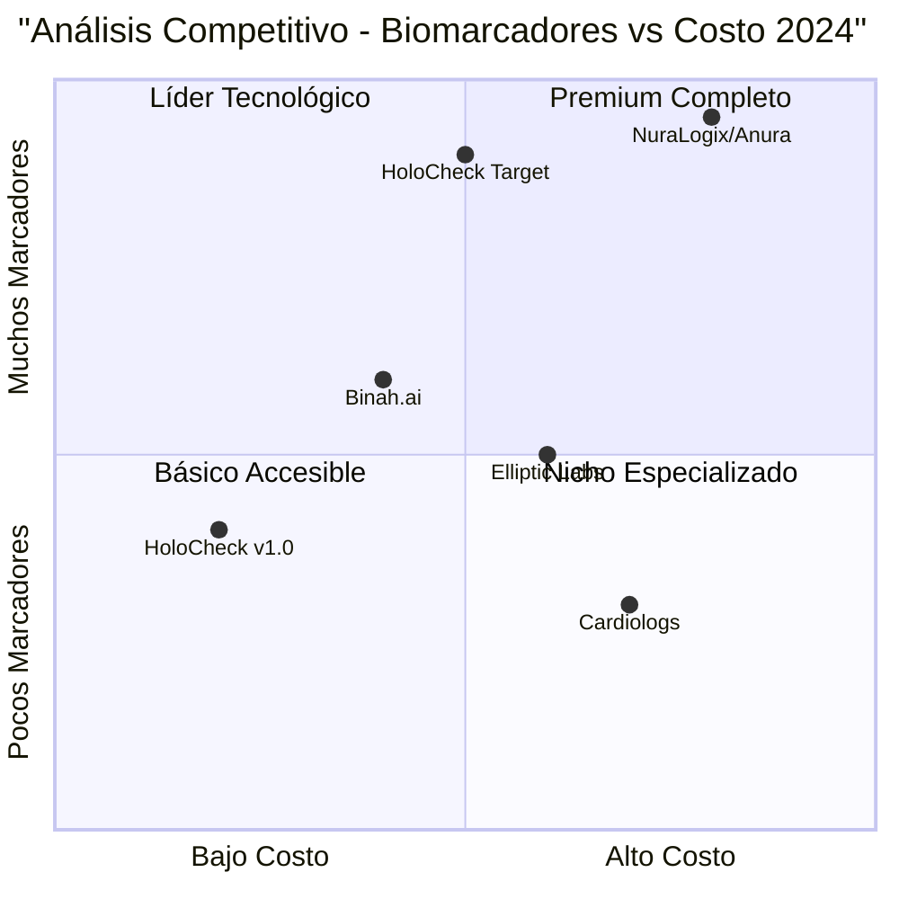

# 🚀 HoloCheck - Roadmap Estratégico Alineado con Business Case
## Plan de Salud Preventiva - Análisis Técnico y Estratégico 2024-2026

---

## 📋 **Resumen Ejecutivo**

**Proyecto:** HoloCheck - Ecosistema de Evaluación Médica Digital Preventiva  
**Versión Base:** v1.0 (Funcional y Estable)  
**Alineación:** Plan de Salud Preventiva CA ExtendidoCapital  
**Horizonte Temporal:** 36 meses (v1.1 → v2.5)  
**Objetivo Estratégico:** "100+ biomarcadores en segundos para transformar la prevención en ROI"

**Recomendación Estratégica:** Desarrollo incremental basado en el modelo de tres pilares (Asegurado-Empresa-Aseguradora), integrando tecnologías NuraLogix/Anura para alcanzar 100+ marcadores biológicos y generar ROI demostrable del 6-12% en reducción de siniestralidad.

---

## 🔍 **Análisis del Business Case - Plan de Salud Preventiva**

### **Modelo de Tres Pilares Estratégicos**

#### **Pilar 1: Asegurado**
- **Descripción:** Chequeo digital mediante selfie (rPPG) y voz
- **Marcadores Objetivo:** 30-100 (selfie) + 20-30 (voz) = **100+ biomarcadores totales**
- **Tecnología Base:** NuraLogix/Anura con análisis facial avanzado
- **Entregable:** Expediente personal dinámico con semáforos de riesgo

#### **Pilar 2: Empresa** 
- **Descripción:** Información anónima y agregada para salud ocupacional
- **Marcadores Clave:** Estrés colectivo, riesgo metabólico, patrones de sueño
- **Beneficio Esperado:** -10% a -20% reducción de ausentismo
- **Acciones:** Campañas wellness, certificación empresa saludable

#### **Pilar 3: Aseguradora**
- **Descripción:** Datos abiertos + biosignales agregados para ajuste actuarial  
- **Beneficio Esperado:** -6% a -12% reducción siniestralidad (12-24 meses)
- **Productos:** Tarificación dinámica, microseguros, vida interactiva

### **Objetivos Estratégicos del Business Case**

**Económicos:**
- ARR Proyectado: $5-6.5M en 36 meses (150-200k vidas)
- Margen Bruto: 17-25% (año 1) → 55% (año 3)
- Reducción Siniestralidad: 6-12% en carteras piloto
- Ahorro por Empleado: $200-400 USD/año

**Operacionales:**
- Participación Objetivo: ≥65% empleados
- Capturas Válidas: ≥85% calidad técnica
- Tiempo de Chequeo: ≤5 minutos
- NPS Target: ≥60

**Expansión Geográfica:**
- **Fase 0:** Costa Rica (INS + empresas piloto)
- **Fase 1:** Panamá (ASSA + Hub SSRP)  
- **Fase 2:** El Salvador, Guatemala
- **Fase 3:** Honduras, Nicaragua

### **Tecnologías Core Identificadas**

**NuraLogix/Anura Integration:**
- **Transdermal Optical Imaging (TOI™):** Patente rPPG avanzada
- **Marcadores Cardiovasculares:** HR, HRV, presión arterial estimada
- **Marcadores Metabólicos:** Riesgo diabetes, HbA1c, glucosa
- **Marcadores Mentales:** Estrés, depresión, ansiedad
- **Precisión:** <8 mmHg desviación en presión arterial

**Arquitectura Técnica Requerida:**
- **Captura Multimodal:** Selfie/vídeo + voz con STT offline
- **Agentes IA:** OpenAI Realtime + Rasa on-premise
- **Expediente FHIR:** Firmado y auditable
- **Privacidad:** Seudonimización + cifrado + aprendizaje federado

---

## 🏆 **Análisis Competitivo - Tecnologías Biométricas 2024**

### **NuraLogix/Anura - Líder en Análisis Facial**

**Fortalezas:**
- ✅ **100+ Biomarcadores:** Mayor cantidad del mercado
- ✅ **Tecnología Patentada:** TOI™ (Transdermal Optical Imaging)
- ✅ **Validación Clínica:** >40,000 pacientes en estudios
- ✅ **30 Segundos:** Análisis completo en tiempo real
- ✅ **Sin Hardware:** Solo cámara convencional

**Marcadores Específicos NuraLogix:**
- **Vitales:** HR, HRV, presión sistólica/diastólica, frecuencia respiratoria
- **Cardiovasculares:** Riesgo 10 años, carga cardíaca, arritmias
- **Metabólicos:** HbA1c, glucosa, diabetes tipo 2, IMC
- **Mentales:** Estrés, depresión, ansiedad
- **Físicos:** Edad facial, grasa hepática, colesterol

**Debilidades:**
- ❌ **Costo Licencia:** Pricing enterprise elevado
- ❌ **Dependencia:** Tecnología propietaria cerrada
- ❌ **Regulatorio:** "Investigational use only" (no FDA)

### **Competidores Alternativos**

#### **Binah.ai**
- **Marcadores:** ~15-20 vitales básicos
- **Tecnología:** rPPG estándar
- **Ventaja:** Menor costo, APIs abiertas
- **Desventaja:** Menos marcadores que NuraLogix

#### **Elliptic Labs**
- **Marcadores:** ~10-15 básicos
- **Tecnología:** Ultrasonido + rPPG
- **Ventaja:** Hardware híbrido
- **Desventaja:** Requiere sensores adicionales

#### **Cardiologs**
- **Marcadores:** ~5-8 cardiovasculares
- **Tecnología:** ECG + IA
- **Ventaja:** Precisión médica
- **Desventaja:** Limitado a cardio, requiere ECG

### **Posicionamiento Competitivo HoloCheck**



**Estrategia de Posicionamiento:**
- **Fase 1:** Integración NuraLogix para alcanzar 100+ marcadores
- **Fase 2:** Desarrollo propio para reducir dependencia y costos
- **Fase 3:** Modelo híbrido con soberanía tecnológica

---

## 🛣️ **Roadmap Estratégico Alineado con Business Case**

### **FASE 0: v1.1 - Preparación Costa Rica (4-8 semanas)**

#### **🎯 Objetivos Alineados con Business Case**
- Convenios marco: INS + 2 empresas piloto (200-500 empleados)
- MVP técnico con integración NuraLogix/Anura
- Feature Store cantón-mes con datos abiertos (MS, CCSS, INEC)
- Cumplimiento Ley 8968 Costa Rica

#### **📋 Features Críticas**

**P0 - Integración NuraLogix (Semana 1-3)**
- **SDK Integration:** NuraLogix DeepAffex Cloud API
- **Captura Biométrica:** 30-segundo selfie análisis
- **Marcadores Core:** 30+ cardiovasculares + metabólicos iniciales
- **Expediente FHIR:** Estructura básica compatible

**P1 - Arquitectura Base (Semana 4-6)**
- **Gestión Estado:** Zustand para datos biométricos
- **Seguridad:** Cifrado end-to-end + seudonimización
- **Dashboard Empresa:** Métricas agregadas anónimas
- **Alertas:** Sistema semáforos riesgo (verde/amarillo/rojo)

**P2 - Compliance (Semana 7-8)**
- **DPIA Completa:** Data Protection Impact Assessment
- **Consentimientos:** Granular por pilar y uso de datos
- **Auditoría:** Logs completos de acceso y procesamiento
- **Retención:** Políticas automáticas de eliminación

#### **🔧 Especificaciones Técnicas**

**Integración NuraLogix:**
```javascript
// services/nuralogixService.js
import { DeepAffexSDK } from '@nuralogix/deepaffex-sdk'

export class NuraLogixAnalyzer {
  constructor() {
    this.sdk = new DeepAffexSDK({
      apiKey: process.env.NURALOGIX_API_KEY,
      region: 'us-east-1',
      privacy: 'on-premise' // Datos no salen de infraestructura
    })
  }

  async analyzeFacialVideo(videoBlob, userConsent) {
    const analysis = await this.sdk.analyze({
      video: videoBlob,
      duration: 30,
      markers: [
        'heart_rate', 'hrv', 'blood_pressure',
        'stress_level', 'diabetes_risk', 'mental_health'
      ],
      privacy: {
        anonymize: true,
        retention: '90-days',
        consent: userConsent
      }
    })

    return this.processResults(analysis)
  }

  processResults(rawResults) {
    return {
      cardiovascular: {
        heartRate: rawResults.heart_rate,
        hrv: rawResults.hrv,
        bloodPressure: rawResults.blood_pressure,
        riskScore: this.calculateCardioRisk(rawResults)
      },
      metabolic: {
        diabetesRisk: rawResults.diabetes_risk,
        hba1c: rawResults.hba1c_estimate,
        bmi: rawResults.bmi_estimate
      },
      mental: {
        stressLevel: rawResults.stress_level,
        anxietyRisk: rawResults.anxiety_risk,
        depressionRisk: rawResults.depression_risk
      },
      timestamp: Date.now(),
      confidence: rawResults.confidence_score
    }
  }
}
```

**Expediente FHIR:**
```javascript
// models/FHIRRecord.js
export class HealthRecord {
  constructor(userId, biometricData) {
    this.fhirVersion = "4.0.1"
    this.resourceType = "Observation"
    this.subject = { reference: `Patient/${userId}` }
    this.effectiveDateTime = new Date().toISOString()
    this.component = this.buildComponents(biometricData)
    this.meta = {
      security: [{ code: "PSEUDONYMIZED" }],
      tag: [{ code: "PREVENTIVE_HEALTH" }]
    }
  }

  buildComponents(data) {
    return [
      {
        code: { coding: [{ code: "8867-4", display: "Heart rate" }] },
        valueQuantity: { value: data.cardiovascular.heartRate, unit: "bpm" }
      },
      {
        code: { coding: [{ code: "55284-4", display: "Blood pressure" }] },
        valueQuantity: { 
          value: data.cardiovascular.bloodPressure.systolic, 
          unit: "mmHg" 
        }
      },
      // ... más componentes según marcadores NuraLogix
    ]
  }
}
```

#### **📊 Métricas de Éxito v1.1**
- **Integración:** 100% funcional con NuraLogix API
- **Marcadores:** 30+ biomarcadores operativos
- **Participación:** ≥65% empleados en piloto
- **Calidad:** ≥85% capturas válidas
- **Compliance:** 100% cumplimiento Ley 8968

---

### **FASE 1: v1.2 - Piloto Controlado Costa Rica (8-12 semanas)**

#### **🎯 Objetivos Business Case**
- Despliegue en 2 empresas de sectores distintos
- KPIs: participación ≥65%, NPS ≥60, detecciones tempranas ≥8%
- Ensayo actuarial: incentivo -3% a -5% en prima
- Validación clínica: concordancia vs dispositivos referencia

#### **📋 Features Avanzadas**

**P0 - Expansión Marcadores (Semana 1-4)**
- **Análisis Voz:** Integración STT + biometría vocal
- **Marcadores Adicionales:** 20-30 respiratorios/neurológicos
- **Total Objetivo:** 50-70 marcadores combinados
- **Validación Clínica:** Protocolo concordancia con dispositivos médicos

**P1 - Dashboard Actuarial (Semana 5-8)**
- **Métricas Aseguradora:** Frecuencia/severidad por cohorte
- **Modelos Predictivos:** Riesgo siniestralidad por perfil
- **Incentivos Automáticos:** Cálculo descuentos preventivos
- **Reportes Regulatorios:** Formato superintendencias

**P2 - Telemedicina (Semana 9-12)**
- **Integración Aliada:** Plataforma consultas remotas
- **Derivación Automática:** Alertas riesgo alto → médico
- **Seguimiento:** Tracking intervenciones preventivas
- **ROI Tracking:** Medición impacto en siniestralidad

#### **🔧 Especificaciones Técnicas**

**Análisis de Voz:**
```javascript
// services/voiceAnalysisService.js
export class VoiceHealthAnalyzer {
  constructor() {
    this.sttEngine = new OfflineSTT({ language: 'es-CR' })
    this.voiceBiomarkers = new VoiceBiomarkerExtractor()
  }

  async analyzeVoiceSample(audioBlob, duration = 60) {
    // Análisis paralelo: contenido + biometría vocal
    const [transcript, biomarkers] = await Promise.all([
      this.sttEngine.transcribe(audioBlob),
      this.voiceBiomarkers.extract(audioBlob)
    ])

    return {
      respiratory: {
        breathingRate: biomarkers.breathing_rate,
        lungCapacity: biomarkers.lung_capacity_estimate,
        respiratoryRisk: biomarkers.respiratory_risk
      },
      mental: {
        stressLevel: biomarkers.vocal_stress,
        depressionRisk: biomarkers.depression_indicators,
        anxietyLevel: biomarkers.anxiety_markers
      },
      neurological: {
        cognitiveLoad: biomarkers.cognitive_load,
        speechClarity: biomarkers.speech_clarity,
        neurologicalRisk: biomarkers.neurological_indicators
      },
      transcript: transcript,
      confidence: biomarkers.confidence_score
    }
  }
}
```

**Dashboard Actuarial:**
```javascript
// components/ActuarialDashboard.jsx
export default function ActuarialDashboard({ insurerData }) {
  const { cohorts, riskModels, claimsData } = useActuarialStore()

  const calculateSinistralityReduction = useMemo(() => {
    return cohorts.map(cohort => {
      const baseline = cohort.historicalClaims
      const current = cohort.currentClaims
      const reduction = ((baseline - current) / baseline) * 100
      
      return {
        cohortId: cohort.id,
        reduction: reduction,
        savings: cohort.memberCount * cohort.avgClaimCost * (reduction/100),
        confidence: cohort.dataQuality
      }
    })
  }, [cohorts])

  return (
    <div className="grid grid-cols-1 lg:grid-cols-3 gap-6">
      <MetricCard title="Reducción Siniestralidad">
        <div className="text-3xl font-bold text-green-600">
          -{calculateSinistralityReduction.reduce((acc, c) => acc + c.reduction, 0) / cohorts.length}%
        </div>
        <div className="text-sm text-gray-500">Promedio 12 meses</div>
      </MetricCard>

      <MetricCard title="Ahorro Proyectado">
        <div className="text-3xl font-bold text-blue-600">
          ${calculateSinistralityReduction.reduce((acc, c) => acc + c.savings, 0).toLocaleString()}
        </div>
        <div className="text-sm text-gray-500">USD anuales</div>
      </MetricCard>

      <MetricCard title="Cohortes Activas">
        <div className="text-3xl font-bold text-purple-600">
          {cohorts.length}
        </div>
        <div className="text-sm text-gray-500">{cohorts.reduce((acc, c) => acc + c.memberCount, 0)} vidas</div>
      </MetricCard>
    </div>
  )
}
```

#### **📊 Métricas de Éxito v1.2**
- **Marcadores Totales:** 50-70 biomarcadores operativos
- **Detecciones Tempranas:** ≥8% casos identificados
- **Reducción Consultas:** ≥5% consultas evitables
- **Incentivo Actuarial:** -3% a -5% prima demostrado
- **NPS:** ≥60 satisfacción usuario

---

### **FASE 2: v1.3 - Escalamiento Regional (12-16 semanas)**

#### **🎯 Objetivos Business Case**
- Expansión Panamá (ASSA + Hub SSRP)
- Integración telemedicina aliada
- Aprendizaje federado CR-PA → modelo regional
- Campaña "Prevención que se nota"

#### **📋 Features Regionales**

**P0 - Expansión Geográfica (Semana 1-6)**
- **Panamá Integration:** ASSA + pathway sandbox
- **Compliance Local:** Ley 81/2019 Panamá
- **Localización:** Acentos, contextos culturales
- **Feature Store Regional:** Datos epidemiológicos PA

**P1 - Aprendizaje Federado (Semana 7-12)**
- **Federated Learning:** Modelos sin mover datos sensibles
- **Cross-Border Analytics:** Insights regionales agregados
- **Model Improvement:** Precisión mejorada con datos multi-país
- **Privacy Preserving:** Técnicas differential privacy

**P2 - Productos Innovadores (Semana 13-16)**
- **Microseguros Preventivos:** Productos accesibles masivos
- **Vida Interactiva:** Underwriting simplificado
- **WhatsApp/IVR:** Captación masiva no-smartphone
- **Gamificación:** Retos saludables empresariales

#### **🔧 Especificaciones Técnicas**

**Aprendizaje Federado:**
```python
# ml/federated_learning.py
import tensorflow_federated as tff

class FederatedHealthModel:
    def __init__(self, countries=['CR', 'PA']):
        self.countries = countries
        self.global_model = self.create_base_model()
        self.country_models = {}
    
    def create_base_model(self):
        return tf.keras.Sequential([
            tf.keras.layers.Dense(128, activation='relu'),
            tf.keras.layers.Dropout(0.3),
            tf.keras.layers.Dense(64, activation='relu'),
            tf.keras.layers.Dense(32, activation='relu'),
            tf.keras.layers.Dense(10, activation='softmax')  # 10 risk categories
        ])
    
    @tff.federated_computation
    def federated_train(self, federated_data):
        # Entrenar modelo sin compartir datos raw
        return tff.learning.build_federated_averaging_process(
            model_fn=self.create_base_model,
            client_optimizer_fn=lambda: tf.keras.optimizers.SGD(0.02),
            server_optimizer_fn=lambda: tf.keras.optimizers.SGD(1.0)
        ).next(self.global_model, federated_data)
    
    def predict_health_risks(self, biomarkers, country='CR'):
        # Usar modelo específico del país si existe, sino global
        model = self.country_models.get(country, self.global_model)
        return model.predict(biomarkers)
```

**Microseguros API:**
```javascript
// services/microInsuranceService.js
export class MicroInsuranceEngine {
  constructor() {
    this.riskCalculator = new RiskCalculator()
    this.pricingEngine = new DynamicPricing()
  }

  async generateMicroPolicy(biometricProfile, demographics) {
    const riskScore = await this.riskCalculator.calculate({
      biomarkers: biometricProfile.markers,
      age: demographics.age,
      location: demographics.location,
      occupation: demographics.occupation
    })

    const premium = this.pricingEngine.calculatePremium({
      riskScore: riskScore,
      coverage: 'basic_preventive',
      duration: '6_months'
    })

    return {
      policyId: generateUUID(),
      premium: premium,
      coverage: {
        preventiveCheckups: 4,
        telemedicineConsults: 12,
        emergencyAlert: true,
        wellnessCoaching: true
      },
      discounts: {
        lowRisk: riskScore < 0.3 ? 0.15 : 0,
        regularCheckups: 0.1,
        companyProgram: 0.05
      },
      validUntil: new Date(Date.now() + 6 * 30 * 24 * 60 * 60 * 1000)
    }
  }
}
```

#### **📊 Métricas de Éxito v1.3**
- **Países Activos:** Costa Rica + Panamá operativos
- **Vidas Totales:** 60k usuarios activos
- **ARR:** $1.8-2.2M revenue anual
- **Margen Bruto:** 42-48% mejorado
- **Federated Learning:** Modelos regionales entrenados

---

### **FASE 3: v2.0 - Plataforma Centroamericana (6-9 meses)**

#### **🎯 Objetivos Business Case**
- Expansión El Salvador, Guatemala, Honduras, Nicaragua
- 150-200k vidas (microseguros + vida interactiva)
- ARR $5-6.5M con margen >55%
- Publicación resultados y caso regional

#### **📋 Features Empresariales**

**P0 - Escalabilidad Masiva (Mes 1-3)**
- **Multi-Tenant Architecture:** Soporte 200k+ usuarios
- **Auto-Scaling:** Infraestructura elástica
- **Edge Computing:** Procesamiento local por país
- **API Gateway:** Rate limiting y versioning

**P1 - IA Generativa (Mes 4-6)**
- **Health Assistant:** GPT-4 integrado con biomarcadores
- **Predictive Analytics:** ML para detección temprana
- **Personalized Coaching:** Recomendaciones individualizadas
- **Clinical Decision Support:** Asistencia médica IA

**P2 - Ecosistema Completo (Mes 7-9)**
- **Marketplace:** Apps terceros y integraciones
- **EHR Integration:** HL7 FHIR con sistemas médicos
- **Wearables:** APIs Apple Health, Google Fit, Fitbit
- **Research Platform:** Colaboración académica

#### **🔧 Especificaciones Técnicas**

**IA Generativa Health Assistant:**
```javascript
// services/aiHealthAssistant.js
import OpenAI from 'openai'

export class AIHealthAssistant {
  constructor() {
    this.openai = new OpenAI({ apiKey: process.env.OPENAI_API_KEY })
    this.clinicalPrompts = new ClinicalPromptLibrary()
  }

  async analyzeHealthTrends(userBiomarkers, historicalData) {
    const prompt = this.clinicalPrompts.buildAnalysisPrompt({
      currentMarkers: userBiomarkers,
      history: historicalData,
      riskFactors: this.extractRiskFactors(userBiomarkers),
      demographics: userBiomarkers.demographics
    })

    const response = await this.openai.chat.completions.create({
      model: "gpt-4",
      messages: [
        {
          role: "system",
          content: `Eres un asistente médico especializado en análisis preventivo. 
                   Analiza biomarcadores y proporciona insights accionables.
                   NUNCA hagas diagnósticos médicos definitivos.
                   Siempre recomienda consulta médica para casos de riesgo.`
        },
        {
          role: "user",
          content: prompt
        }
      ],
      temperature: 0.3,
      max_tokens: 1000
    })

    return this.parseHealthInsights(response.choices[0].message.content)
  }

  parseHealthInsights(aiResponse) {
    return {
      trends: this.extractTrends(aiResponse),
      risks: this.extractRisks(aiResponse),
      recommendations: this.extractRecommendations(aiResponse),
      urgency: this.assessUrgency(aiResponse),
      confidence: this.calculateConfidence(aiResponse)
    }
  }
}
```

**Predictive Analytics Engine:**
```python
# ml/predictive_engine.py
import numpy as np
from sklearn.ensemble import RandomForestClassifier
from sklearn.neural_network import MLPClassifier

class HealthRiskPredictor:
    def __init__(self):
        self.models = {
            'cardiovascular': RandomForestClassifier(n_estimators=100),
            'diabetes': MLPClassifier(hidden_layer_sizes=(100, 50)),
            'mental_health': RandomForestClassifier(n_estimators=150),
            'respiratory': MLPClassifier(hidden_layer_sizes=(80, 40))
        }
        self.feature_importance = {}
    
    def train_models(self, training_data):
        for condition, model in self.models.items():
            X = training_data[condition]['features']
            y = training_data[condition]['labels']
            
            model.fit(X, y)
            
            # Calcular importancia de características
            if hasattr(model, 'feature_importances_'):
                self.feature_importance[condition] = model.feature_importances_
    
    def predict_risks(self, biomarkers, demographics, lifestyle):
        features = self.engineer_features(biomarkers, demographics, lifestyle)
        predictions = {}
        
        for condition, model in self.models.items():
            risk_probability = model.predict_proba(features.reshape(1, -1))[0][1]
            risk_level = self.categorize_risk(risk_probability)
            
            predictions[condition] = {
                'probability': float(risk_probability),
                'level': risk_level,
                'confidence': self.calculate_prediction_confidence(features, condition),
                'key_factors': self.get_key_risk_factors(features, condition)
            }
        
        return predictions
    
    def engineer_features(self, biomarkers, demographics, lifestyle):
        # Combinar todas las fuentes de datos en vector de características
        features = np.concatenate([
            self.normalize_biomarkers(biomarkers),
            self.encode_demographics(demographics),
            self.encode_lifestyle(lifestyle)
        ])
        return features
```

#### **📊 Métricas de Éxito v2.0**
- **Cobertura Regional:** 5 países centroamericanos
- **Usuarios Activos:** 150-200k vidas
- **ARR:** $5-6.5M revenue anual
- **Margen:** >55% rentabilidad
- **Impacto:** Caso de estudio regional publicado

---

## 💰 **Análisis de Inversión y ROI Alineado**

### **Presupuesto Total Business Case (36 meses)**

#### **Inversión por Fase:**
- **v1.1 (Preparación):** $180,000 (I+D + plataforma)
- **v1.2 (Piloto):** $280,000 (equipo + pilotos + legal)
- **v1.3 (Regional):** $420,000 (expansión + federated learning)
- **v2.0 (Escalamiento):** $650,000 (IA + infraestructura + marketing)

**Total Inversión:** $1,530,000 USD

#### **Proyección de Ingresos (Business Case):**
- **Mes 0-6:** 10k vidas → ARR $450k
- **Mes 7-18:** 60k vidas → ARR $1.8-2.2M  
- **Mes 19-36:** 150-200k vidas → ARR $5-6.5M

#### **ROI Proyectado:**
- **Break-even:** Mes 15-18
- **ROI 36 meses:** 325-425%
- **Margen Final:** >55%

### **Beneficios Cuantificados por Pilar**

#### **Pilar 1 - Asegurado:**
- **Detección Temprana:** 8-12% casos identificados
- **Satisfacción:** NPS ≥60
- **Engagement:** ≥65% participación sostenida

#### **Pilar 2 - Empresa:**
- **Reducción Ausentismo:** -10% a -20%
- **Ahorro por Empleado:** $200-400 USD/año
- **Productividad:** +5-8% mejora reportada

#### **Pilar 3 - Aseguradora:**
- **Reducción Siniestralidad:** -6% a -12% (12-24 meses)
- **Retención Clientes:** +2-4 puntos porcentuales
- **Nuevos Productos:** Microseguros + vida interactiva

---

## 🎯 **Recomendaciones Estratégicas Finales**

### **Decisiones Críticas Inmediatas**

#### **1. Integración NuraLogix (30 días)**
- **Acción:** Negociar licencia enterprise NuraLogix/Anura
- **Objetivo:** Acceso a 100+ biomarcadores patentados
- **Inversión:** $50-80k anuales estimados
- **ROI:** Diferenciación competitiva crítica

#### **2. Piloto Costa Rica (60 días)**
- **Acción:** Firmar convenio INS + 2 empresas piloto
- **Objetivo:** Validar modelo tres pilares
- **Métricas:** ≥65% participación, -3% prima demostrada
- **Riesgo:** Sin piloto exitoso, no hay escalamiento

#### **3. Equipo Técnico (90 días)**
- **Acción:** Contratar ML engineer + compliance officer
- **Objetivo:** Capacidad desarrollo interno
- **Inversión:** $120k anuales
- **Beneficio:** Reducir dependencia tecnológica externa

### **Roadmap de Implementación Recomendado**

#### **Próximos 90 días (CRÍTICO):**
1. ✅ **Semana 1-2:** Negociación y firma licencia NuraLogix
2. ✅ **Semana 3-4:** Convenio INS Costa Rica + selección empresas piloto
3. ✅ **Semana 5-8:** Desarrollo MVP con integración NuraLogix
4. ✅ **Semana 9-12:** Despliegue piloto controlado + métricas iniciales

#### **Siguientes 6 meses:**
- **Mes 4-5:** Expansión Panamá + ASSA
- **Mes 6:** Validación actuarial + incentivos
- **Mes 7-8:** Preparación El Salvador/Guatemala
- **Mes 9:** Publicación resultados piloto

#### **Año 2-3:**
- **Escalamiento masivo:** 150-200k vidas
- **IA Generativa:** Health assistant completo
- **Investigación:** Publicación caso regional

### **Factores Críticos de Éxito**

#### **Técnicos:**
- ✅ **Integración NuraLogix:** 100+ biomarcadores operativos
- ✅ **Calidad Datos:** ≥85% capturas válidas
- ✅ **Performance:** <5 min por chequeo completo
- ✅ **Escalabilidad:** Soporte 200k+ usuarios concurrentes

#### **Comerciales:**
- ✅ **Adopción:** ≥65% participación empleados
- ✅ **Retención:** NPS ≥60 sostenido
- ✅ **ROI Demostrable:** -6% siniestralidad mínimo
- ✅ **Expansión:** 2+ países año 1

#### **Regulatorios:**
- ✅ **Compliance:** 100% cumplimiento local
- ✅ **Privacidad:** Auditorías exitosas
- ✅ **Sandbox:** Participación hubs innovación
- ✅ **Publicación:** Caso de estudio regulatorio

---

## 📋 **Conclusiones y Próximos Pasos**

### **Oportunidad Estratégica**
El business case demuestra una oportunidad de $5-6.5M ARR en 36 meses con ROI del 325-425%, basada en:

1. **Diferenciación Técnica:** 100+ biomarcadores únicos vía NuraLogix
2. **Modelo Probado:** Tres pilares con beneficios cuantificados
3. **Mercado Preparado:** Regulación favorable + demanda preventiva
4. **Escalabilidad Regional:** 5 países, 200k+ vidas potenciales

### **Recomendación Final**
**EJECUTAR roadmap completo con inversión de $1.53M en 36 meses para capturar liderazgo en salud preventiva centroamericana.**

### **Próximos Pasos Críticos (30 días)**
1. ✅ **Aprobar presupuesto:** $1.53M inversión total
2. ✅ **Negociar NuraLogix:** Licencia enterprise 100+ marcadores  
3. ✅ **Firmar INS Costa Rica:** Convenio marco aseguradora ancla
4. ✅ **Contratar equipo:** ML engineer + compliance officer
5. ✅ **Iniciar desarrollo:** MVP v1.1 con integración NuraLogix

---

**Documento preparado por:** Emma (Product Manager)  
**Alineación:** Plan de Salud Preventiva CA ExtendidoCapital  
**Fecha:** 10 de Septiembre, 2024  
**Versión:** 2.0 Business Aligned  
**Próxima Revisión:** 15 de Octubre, 2024