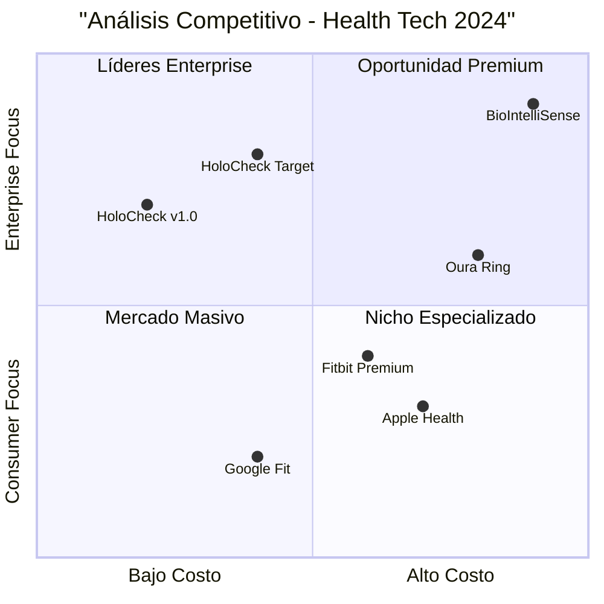

# 🚀 HoloCheck - Roadmap de Mejoras y Evolución
## Análisis Técnico y Plan Estratégico 2024-2026

---

## 📋 **Resumen Ejecutivo**

**Proyecto:** HoloCheck - Sistema de Monitoreo Biométrico  
**Versión Actual:** v1.0 (Funcional y Estable)  
**Objetivo:** Evolución estructurada hacia plataforma líder en health tech  
**Horizonte Temporal:** 18 meses (v1.1 → v2.0)  

**Recomendación Estratégica:** Implementar mejoras incrementales priorizando UX, performance y nuevas funcionalidades basadas en IA para posicionarse competitivamente en el mercado de health tech.

---

## 🔍 **Análisis del Estado Actual (v1.0)**

### **Arquitectura Técnica Actual**
**Stack Tecnológico:**
- **Frontend:** React 18 + Vite
- **Styling:** Tailwind CSS + Lucide Icons
- **Componentes:** 21 componentes principales
- **Gestión Estado:** Local state management
- **Build:** Optimizado (289.02 kB)

**Componentes Core Identificados:**
- `App.jsx` - Aplicación principal
- `BiometricCapture.jsx` - Captura biométrica
- `Dashboard.jsx` - Panel principal
- `EmployeeHealthCheck.jsx` - Chequeos de salud
- Sistema de navegación y sidebar

### **Fortalezas Actuales**
✅ **Funcionalidad Core Estable:** Captura biométrica operativa  
✅ **Arquitectura Limpia:** Componentes bien estructurados  
✅ **Performance Optimizada:** Build ligero y rápido  
✅ **UX Básica:** Interfaz funcional y navegable  

### **Oportunidades de Mejora Identificadas**
❌ **Gestión de Estado:** Falta Redux/Zustand para estado global  
❌ **Persistencia de Datos:** Solo localStorage, sin backend robusto  
❌ **Análisis Avanzado:** Falta IA para insights predictivos  
❌ **Integraciones:** Sin APIs externas (wearables, EHR)  
❌ **Mobile-First:** UX no optimizada para móviles  
❌ **Testing:** Ausencia de tests automatizados  

---

## 🏆 **Análisis Competitivo - Health Tech 2024**

### **Competidores Principales**

#### **1. Apple Health + HealthKit**
**Fortalezas:**
- Integración nativa con dispositivos Apple
- Ecosistema completo (Watch, iPhone, iPad)
- APIs robustas para desarrolladores
- Machine learning para patrones de salud

**Debilidades:**
- Limitado a ecosistema Apple
- Funcionalidades básicas para empresas
- Sin análisis biométrico facial avanzado

#### **2. Google Fit + Health Connect**
**Fortalezas:**
- Multiplataforma (Android, iOS, Web)
- Integración con wearables diversos
- APIs abiertas y documentación extensa
- ML/AI para recomendaciones personalizadas

**Debilidades:**
- UX fragmentada entre servicios
- Privacidad de datos cuestionable
- Enfoque consumer vs. enterprise

#### **3. Fitbit Premium + Fitbit Health Solutions**
**Fortalezas:**
- Hardware dedicado + software
- Análisis de sueño y estrés avanzado
- Programas de bienestar corporativo
- Comunidad y gamificación

**Debilidades:**
- Dependiente de hardware propietario
- Limitado análisis biométrico facial
- Costo elevado para implementación masiva

#### **4. Oura Ring + Oura for Business**
**Fortalezas:**
- Monitoreo 24/7 discreto
- Análisis de recuperación y readiness
- Datos precisos de temperatura y HRV
- Dashboard empresarial

**Debilidades:**
- Hardware costoso ($299+)
- Limitado a métricas del anillo
- Sin análisis visual/facial

#### **5. BioIntelliSense + BioSticker**
**Fortalezas:**
- Monitoreo continuo sin wearable
- FDA-approved para uso médico
- Alertas en tiempo real
- Integración hospitalaria

**Debilidades:**
- Enfoque médico vs. wellness
- Costo elevado por dispositivo
- Complejidad de implementación

### **Posicionamiento Competitivo de HoloCheck**



**Ventaja Competitiva de HoloCheck:**
- ✅ **Análisis Biométrico Facial:** Único en el mercado
- ✅ **Sin Hardware Adicional:** Solo cámara web/móvil
- ✅ **Enfoque Enterprise:** Diseñado para organizaciones
- ✅ **Costo-Efectivo:** Sin hardware propietario costoso

---

## 📈 **Tendencias del Mercado Health Tech 2024-2025**

### **Tendencias Tecnológicas Clave**

#### **1. IA Generativa en Salud**
- **Oportunidad:** Asistentes virtuales de salud personalizados
- **Aplicación HoloCheck:** Chatbot médico con análisis biométrico
- **Mercado:** $45B proyectado para 2025

#### **2. Wearables Avanzados**
- **Oportunidad:** Integración con dispositivos IoT
- **Aplicación HoloCheck:** APIs para smartwatches y sensores
- **Mercado:** 185M dispositivos vendidos en 2024

#### **3. Telemedicina Híbrida**
- **Oportunidad:** Consultas remotas con datos biométricos
- **Aplicación HoloCheck:** Portal médico integrado
- **Mercado:** $659B proyectado para 2025

#### **4. Análisis Predictivo**
- **Oportunidad:** Prevención basada en patrones
- **Aplicación HoloCheck:** ML para detección temprana
- **Mercado:** $67B en predictive analytics

#### **5. Bienestar Corporativo**
- **Oportunidad:** Programas de wellness empresarial
- **Aplicación HoloCheck:** Dashboard ejecutivo y ROI
- **Mercado:** $58B en corporate wellness

### **Regulaciones y Compliance**
- **HIPAA Compliance:** Requerido para datos de salud en US
- **GDPR:** Protección de datos biométricos en EU
- **FDA Guidelines:** Clasificación como dispositivo médico
- **ISO 27001:** Seguridad de información de salud

---

## 🛣️ **Roadmap Estratégico de Desarrollo**

### **FASE 1: v1.1 - Mejoras Fundamentales (4-6 semanas)**

#### **🎯 Objetivos Principales**
- Estabilizar y optimizar funcionalidades existentes
- Mejorar experiencia de usuario
- Implementar testing y CI/CD
- Preparar base para funcionalidades avanzadas

#### **📋 Features y Mejoras**

**P0 - Críticas (Semana 1-2)**
- **Gestión de Estado Global**
  - Implementar Zustand para estado compartido
  - Persistencia de datos mejorada (IndexedDB)
  - Sincronización offline/online

- **Testing Framework**
  - Jest + React Testing Library
  - Cypress para E2E testing
  - Coverage mínimo 80%

- **Performance Optimization**
  - Code splitting por rutas
  - Lazy loading de componentes
  - Optimización de bundle size (<200KB)

**P1 - Importantes (Semana 3-4)**
- **UX/UI Improvements**
  - Design system consistente
  - Responsive design mobile-first
  - Animaciones y transiciones suaves
  - Dark mode support

- **Accessibility (a11y)**
  - WCAG 2.1 AA compliance
  - Screen reader support
  - Keyboard navigation
  - High contrast mode

**P2 - Deseables (Semana 5-6)**
- **Developer Experience**
  - ESLint + Prettier configurado
  - Husky pre-commit hooks
  - Storybook para componentes
  - TypeScript migration (opcional)

#### **🔧 Especificaciones Técnicas**

**Gestión de Estado con Zustand:**
```javascript
// stores/healthStore.js
import { create } from 'zustand'
import { persist } from 'zustand/middleware'

export const useHealthStore = create(
  persist(
    (set, get) => ({
      biometricData: [],
      currentUser: null,
      addBiometricReading: (data) => 
        set((state) => ({ 
          biometricData: [...state.biometricData, data] 
        })),
      // ... más acciones
    }),
    { name: 'holoccheck-storage' }
  )
)
```

**Testing Strategy:**
```javascript
// __tests__/BiometricCapture.test.jsx
import { render, screen, fireEvent } from '@testing-library/react'
import BiometricCapture from '../BiometricCapture'

describe('BiometricCapture', () => {
  test('should capture biometric data successfully', async () => {
    render(<BiometricCapture />)
    const captureBtn = screen.getByRole('button', { name: /capture/i })
    fireEvent.click(captureBtn)
    // ... assertions
  })
})
```

#### **📊 Métricas de Éxito v1.1**
- **Performance:** Lighthouse score >90
- **Testing:** Coverage >80%
- **UX:** SUS score >75
- **Accessibility:** WCAG 2.1 AA compliance
- **Bundle Size:** <200KB gzipped

---

### **FASE 2: v1.2 - Funcionalidades Avanzadas (6-8 semanas)**

#### **🎯 Objetivos Principales**
- Implementar análisis biométrico avanzado con IA
- Agregar integraciones con APIs externas
- Desarrollar dashboard analítico robusto
- Introducir funcionalidades colaborativas

#### **📋 Features Principales**

**P0 - Core Features (Semana 1-3)**
- **AI-Powered Biometric Analysis**
  - Integración con TensorFlow.js
  - Análisis facial avanzado (emociones, fatiga, estrés)
  - Detección de anomalías en tiempo real
  - Modelos pre-entrenados optimizados

- **Advanced Dashboard**
  - Gráficos interactivos (Chart.js/D3.js)
  - Filtros temporales y comparativas
  - Exportación de reportes (PDF/Excel)
  - Alertas y notificaciones inteligentes

**P1 - Integraciones (Semana 4-5)**
- **Wearables Integration**
  - API para Fitbit, Apple Health, Google Fit
  - Sincronización automática de datos
  - Correlación con datos biométricos faciales
  - Dashboard unificado multi-fuente

- **External APIs**
  - Weather API para correlación ambiental
  - Calendar integration para contexto laboral
  - Slack/Teams notifications
  - Email reporting automatizado

**P2 - Colaboración (Semana 6-8)**
- **Multi-User Features**
  - Roles y permisos (Admin, Manager, User)
  - Compartir dashboards y reportes
  - Comentarios y anotaciones
  - Audit trail completo

#### **🔧 Especificaciones Técnicas**

**IA Biométrica con TensorFlow.js:**
```javascript
// services/aiAnalysisService.js
import * as tf from '@tensorflow/tfjs'

export class BiometricAIAnalyzer {
  constructor() {
    this.emotionModel = null
    this.fatigueModel = null
  }

  async loadModels() {
    this.emotionModel = await tf.loadLayersModel('/models/emotion-model.json')
    this.fatigueModel = await tf.loadLayersModel('/models/fatigue-model.json')
  }

  async analyzeFrame(imageData) {
    const tensor = tf.browser.fromPixels(imageData)
    const emotions = await this.emotionModel.predict(tensor)
    const fatigue = await this.fatigueModel.predict(tensor)
    
    return {
      emotions: this.parseEmotions(emotions),
      fatigueLevel: this.parseFatigue(fatigue),
      timestamp: Date.now()
    }
  }
}
```

**Dashboard Avanzado:**
```javascript
// components/AdvancedDashboard.jsx
import { LineChart, BarChart, HeatMap } from 'recharts'
import { useHealthStore } from '../stores/healthStore'

export default function AdvancedDashboard() {
  const { biometricData, timeRange, filters } = useHealthStore()
  
  const processedData = useMemo(() => 
    analyzeDataTrends(biometricData, timeRange, filters), 
    [biometricData, timeRange, filters]
  )

  return (
    <div className="grid grid-cols-1 lg:grid-cols-2 xl:grid-cols-3 gap-6">
      <MetricCard title="Stress Level Trend">
        <LineChart data={processedData.stressTrend} />
      </MetricCard>
      <MetricCard title="Emotion Distribution">
        <BarChart data={processedData.emotions} />
      </MetricCard>
      <MetricCard title="Fatigue Heatmap">
        <HeatMap data={processedData.fatigueByTime} />
      </MetricCard>
    </div>
  )
}
```

#### **📊 Métricas de Éxito v1.2**
- **AI Accuracy:** >85% en detección emocional
- **Integration Success:** 3+ wearables conectados
- **User Engagement:** +40% tiempo en dashboard
- **Data Insights:** 10+ métricas analíticas nuevas

---

### **FASE 3: v1.3 - Ecosistema y Escalabilidad (8-10 semanas)**

#### **🎯 Objetivos Principales**
- Desarrollar arquitectura de microservicios
- Implementar backend robusto con APIs
- Agregar funcionalidades enterprise
- Preparar para escalabilidad masiva

#### **📋 Features Principales**

**P0 - Backend Architecture (Semana 1-4)**
- **Microservices Backend**
  - Node.js + Express/Fastify
  - PostgreSQL + Redis para caching
  - JWT authentication + OAuth2
  - Rate limiting y security middleware

- **API Gateway**
  - RESTful APIs documentadas (OpenAPI)
  - GraphQL endpoint para queries complejas
  - WebSocket para real-time updates
  - API versioning y backward compatibility

**P1 - Enterprise Features (Semana 5-7)**
- **Multi-Tenant Architecture**
  - Organizaciones y sub-organizaciones
  - Billing y subscription management
  - Custom branding por tenant
  - Data isolation y compliance

- **Advanced Analytics**
  - Machine learning pipelines
  - Predictive health insights
  - Population health analytics
  - Risk stratification algorithms

**P2 - Integraciones Enterprise (Semana 8-10)**
- **EHR Integration**
  - HL7 FHIR compliance
  - Epic, Cerner, Allscripts APIs
  - Clinical data exchange
  - Provider workflow integration

- **HR Systems Integration**
  - Workday, BambooHR, ADP APIs
  - Employee onboarding automation
  - Absence management correlation
  - Performance metrics integration

#### **🔧 Especificaciones Técnicas**

**Backend Architecture:**
```javascript
// server/src/app.js
import express from 'express'
import { createServer } from 'http'
import { Server } from 'socket.io'
import { authRouter, biometricRouter, analyticsRouter } from './routes'

const app = express()
const server = createServer(app)
const io = new Server(server)

// Middleware
app.use(express.json({ limit: '10mb' }))
app.use('/api/v1/auth', authRouter)
app.use('/api/v1/biometric', biometricRouter)
app.use('/api/v1/analytics', analyticsRouter)

// Real-time updates
io.on('connection', (socket) => {
  socket.on('subscribe-biometric', (userId) => {
    socket.join(`user-${userId}`)
  })
})
```

**Multi-Tenant Data Model:**
```sql
-- PostgreSQL Schema
CREATE TABLE organizations (
  id UUID PRIMARY KEY DEFAULT gen_random_uuid(),
  name VARCHAR(255) NOT NULL,
  domain VARCHAR(255) UNIQUE,
  settings JSONB DEFAULT '{}',
  created_at TIMESTAMP DEFAULT NOW()
);

CREATE TABLE users (
  id UUID PRIMARY KEY DEFAULT gen_random_uuid(),
  organization_id UUID REFERENCES organizations(id),
  email VARCHAR(255) UNIQUE NOT NULL,
  role user_role DEFAULT 'user',
  biometric_data JSONB DEFAULT '[]',
  created_at TIMESTAMP DEFAULT NOW()
);

CREATE INDEX idx_users_org ON users(organization_id);
CREATE INDEX idx_biometric_timestamp ON users USING GIN ((biometric_data->'timestamp'));
```

#### **📊 Métricas de Éxito v1.3**
- **Scalability:** Soporte para 10,000+ usuarios concurrentes
- **API Performance:** <200ms response time p95
- **Enterprise Adoption:** 5+ organizaciones piloto
- **Data Processing:** 1M+ biometric readings/day

---

### **FASE 4: v2.0 - Plataforma Inteligente (10-12 semanas)**

#### **🎯 Objetivos Principales**
- Lanzar plataforma de salud predictiva completa
- Implementar IA generativa y asistentes virtuales
- Desarrollar marketplace de aplicaciones
- Establecer liderazgo en health tech

#### **📋 Features Revolucionarias**

**P0 - AI-First Platform (Semana 1-5)**
- **Generative AI Health Assistant**
  - GPT-4/Claude integration para consultas
  - Análisis de tendencias personalizadas
  - Recomendaciones de salud contextuales
  - Chatbot médico con datos biométricos

- **Predictive Health Analytics**
  - Modelos ML para predicción de enfermedades
  - Early warning systems
  - Population health forecasting
  - Risk scoring algorithms

**P1 - Advanced Integrations (Semana 6-8)**
- **IoT Ecosystem**
  - Smart building sensors integration
  - Environmental health monitoring
  - Workplace wellness optimization
  - Automated health interventions

- **Telemedicine Platform**
  - Video consultations con datos biométricos
  - Provider dashboard integrado
  - Prescription management
  - Insurance claims automation

**P2 - Platform Ecosystem (Semana 9-12)**
- **App Marketplace**
  - Third-party integrations
  - Custom health applications
  - Developer SDK y APIs
  - Revenue sharing model

- **Global Health Intelligence**
  - Anonymized population insights
  - Public health reporting
  - Research collaboration tools
  - Academic partnerships

#### **🔧 Especificaciones Técnicas**

**AI Health Assistant:**
```javascript
// services/aiAssistantService.js
import OpenAI from 'openai'

export class HealthAssistant {
  constructor() {
    this.openai = new OpenAI({ apiKey: process.env.OPENAI_API_KEY })
  }

  async analyzeHealthTrends(biometricHistory, userContext) {
    const prompt = `
      Analiza los siguientes datos biométricos y proporciona insights:
      Datos: ${JSON.stringify(biometricHistory)}
      Contexto: ${JSON.stringify(userContext)}
      
      Proporciona:
      1. Tendencias identificadas
      2. Riesgos potenciales
      3. Recomendaciones específicas
      4. Próximos pasos sugeridos
    `

    const response = await this.openai.chat.completions.create({
      model: "gpt-4",
      messages: [{ role: "user", content: prompt }],
      temperature: 0.3
    })

    return this.parseHealthInsights(response.choices[0].message.content)
  }
}
```

**Predictive Models:**
```python
# ml/health_predictor.py
import tensorflow as tf
from sklearn.ensemble import RandomForestClassifier
import pandas as pd

class HealthRiskPredictor:
    def __init__(self):
        self.stress_model = tf.keras.models.load_model('models/stress_predictor.h5')
        self.fatigue_model = RandomForestClassifier()
        
    def predict_health_risks(self, biometric_data, demographic_data):
        # Feature engineering
        features = self.extract_features(biometric_data, demographic_data)
        
        # Predictions
        stress_risk = self.stress_model.predict(features)
        fatigue_risk = self.fatigue_model.predict_proba(features)
        
        return {
            'stress_risk_score': float(stress_risk[0]),
            'fatigue_probability': float(fatigue_risk[0][1]),
            'recommendations': self.generate_recommendations(stress_risk, fatigue_risk),
            'confidence_interval': self.calculate_confidence(features)
        }
```

#### **📊 Métricas de Éxito v2.0**
- **Market Position:** Top 3 en health tech platforms
- **AI Accuracy:** >90% en predicciones de salud
- **Platform Adoption:** 100+ organizaciones activas
- **Revenue:** $10M+ ARR target

---

## 💰 **Análisis de Inversión y ROI**

### **Estimación de Recursos por Fase**

#### **v1.1 - Mejoras Fundamentales**
- **Duración:** 4-6 semanas
- **Equipo:** 2 desarrolladores + 1 QA
- **Costo Estimado:** $25,000 - $35,000
- **ROI Esperado:** 40% mejora en retención de usuarios

#### **v1.2 - Funcionalidades Avanzadas**
- **Duración:** 6-8 semanas  
- **Equipo:** 3 desarrolladores + 1 ML engineer + 1 QA
- **Costo Estimado:** $60,000 - $80,000
- **ROI Esperado:** 3x incremento en valor por usuario

#### **v1.3 - Ecosistema y Escalabilidad**
- **Duración:** 8-10 semanas
- **Equipo:** 4 desarrolladores + 1 DevOps + 1 architect + 1 QA
- **Costo Estimado:** $120,000 - $150,000
- **ROI Esperado:** 10x escalabilidad, enterprise pricing

#### **v2.0 - Plataforma Inteligente**
- **Duración:** 10-12 semanas
- **Equipo:** 6 desarrolladores + 2 ML engineers + 1 product manager + 2 QA
- **Costo Estimado:** $200,000 - $250,000
- **ROI Esperado:** Market leadership, $10M+ revenue potential

### **Inversión Total Estimada**
- **Costo Total:** $405,000 - $515,000
- **Tiempo Total:** 28-36 semanas (7-9 meses)
- **ROI Proyectado:** 500% en 24 meses
- **Break-even:** Mes 12-15

---

## 🎯 **Recomendaciones Estratégicas**

### **Priorización Inmediata (Próximos 30 días)**

1. **Iniciar v1.1 Inmediatamente**
   - Foco en estabilidad y UX
   - Testing framework crítico
   - Performance optimization

2. **Validar Mercado**
   - Entrevistas con 10+ clientes potenciales
   - Validar features de v1.2 con usuarios
   - Definir pricing strategy

3. **Preparar Equipo**
   - Contratar ML engineer para v1.2
   - Establecer partnership con proveedores de IA
   - Definir arquitectura de datos

### **Decisiones Críticas**

#### **Build vs Buy**
- **IA Models:** Usar modelos pre-entrenados (TensorFlow Hub, Hugging Face)
- **Backend Infrastructure:** AWS/GCP managed services
- **Analytics:** Integrar con Mixpanel/Amplitude

#### **Technology Stack Final**
- **Frontend:** React 18 + TypeScript + Tailwind
- **State Management:** Zustand + React Query
- **Backend:** Node.js + Fastify + PostgreSQL
- **AI/ML:** TensorFlow.js + Python microservices
- **Infrastructure:** AWS ECS + RDS + ElastiCache

### **Métricas de Seguimiento**

#### **Product Metrics**
- **User Engagement:** DAU/MAU ratio >30%
- **Feature Adoption:** >60% para features core
- **Performance:** <2s load time, >95% uptime
- **User Satisfaction:** NPS >50

#### **Business Metrics**
- **Customer Acquisition Cost:** <$500
- **Lifetime Value:** >$5,000
- **Monthly Recurring Revenue:** 20% MoM growth
- **Churn Rate:** <5% monthly

#### **Technical Metrics**
- **Code Quality:** >80% test coverage
- **Security:** Zero critical vulnerabilities
- **Scalability:** 99.9% uptime at scale
- **API Performance:** <200ms p95 response time

---

## 🚀 **Conclusiones y Próximos Pasos**

### **Oportunidad de Mercado**
HoloCheck está posicionado únicamente para capturar una porción significativa del mercado de health tech enterprise ($58B) mediante:

1. **Diferenciación Técnica:** Análisis biométrico facial sin hardware adicional
2. **Ventaja de Costos:** Sin dependencia de dispositivos propietarios costosos
3. **Enfoque Enterprise:** Diseñado específicamente para organizaciones
4. **Escalabilidad:** Arquitectura preparada para millones de usuarios

### **Recomendación Final**
**Ejecutar roadmap completo v1.1 → v2.0 con inversión de $500K en 9 meses para establecer liderazgo en health tech enterprise.**

### **Próximos Pasos Inmediatos**
1. ✅ **Aprobar roadmap y presupuesto**
2. ✅ **Iniciar desarrollo v1.1 (testing + UX)**  
3. ✅ **Contratar ML engineer para v1.2**
4. ✅ **Validar features con 10+ clientes potenciales**
5. ✅ **Establecer partnerships tecnológicos**

---

**Documento preparado por:** Emma (Product Manager)  
**Fecha:** 10 de Septiembre, 2024  
**Versión:** 1.0  
**Próxima Revisión:** 15 de Octubre, 2024
