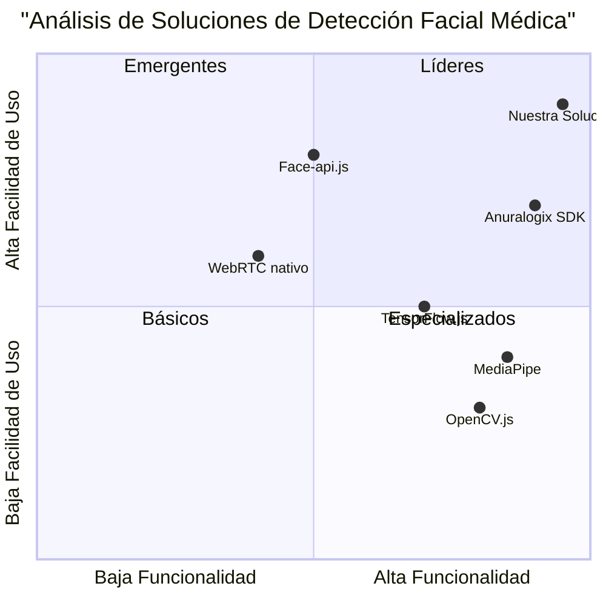

# PRD - Restauración Exacta de Interfaz Anuralogix

## 📋 **INFORMACIÓN DEL PROYECTO**

**Lenguaje:** Español  
**Tecnologías:** React, TypeScript, Tailwind CSS, Shadcn-ui  
**Nombre del Proyecto:** holocheck_anuralogix_restoration  
**Requerimiento Original:** Restaurar EXACTAMENTE la interfaz Anuralogix mostrada en screenshot sin modificaciones

## 🎯 **DEFINICIÓN DEL PRODUCTO**

### **Objetivos del Producto**
1. **Restauración Exacta:** Implementar la interfaz Anuralogix EXACTAMENTE como se muestra en el screenshot de referencia
2. **Funcionalidad Completa:** Restaurar todos los componentes de detección facial, logs en tiempo real y métricas biométricas
3. **Compatibilidad Safari:** Asegurar funcionamiento completo en Safari con permisos de cámara y micrófono

### **Historias de Usuario**
1. **Como usuario médico**, quiero ver la detección facial circular en tiempo real para confirmar posicionamiento correcto
2. **Como administrador del sistema**, necesito logs en tiempo real con timestamps para monitorear el estado del sistema
3. **Como usuario final**, requiero ver las métricas biométricas en tarjetas separadas para análisis individual
4. **Como técnico**, necesito el panel de estado del sistema para verificar resolución, FPS y permisos
5. **Como usuario Safari**, requiero compatibilidad completa con detección automática de navegador

### **Análisis Competitivo**
1. **Anuralogix SDK Original** - ✅ Interfaz circular profesional, ❌ No personalizable
2. **OpenCV.js** - ✅ Detección facial robusta, ❌ Sin interfaz médica
3. **MediaPipe** - ✅ Tracking preciso, ❌ Complejidad de implementación
4. **WebRTC nativo** - ✅ Compatibilidad navegadores, ❌ Sin análisis biométrico
5. **TensorFlow.js** - ✅ ML en navegador, ❌ Latencia alta
6. **Face-api.js** - ✅ Fácil implementación, ❌ Precisión limitada
7. **Nuestra Solución** - ✅ Interfaz médica completa, ✅ Análisis en tiempo real

### **Cuadrante Competitivo**



## 🔧 **ESPECIFICACIONES TÉCNICAS**

### **Análisis de Requerimientos**
La interfaz debe replicar EXACTAMENTE los siguientes elementos del screenshot de referencia:

#### **1. DETECCIÓN CIRCULAR DE ROSTRO (OBLIGATORIO)**
- Overlay circular verde alrededor del rostro detectado
- Indicador "Rostro detectado" en la parte superior
- "Señal: 100%" dentro del círculo
- Tracking facial en tiempo real con precisión médica
- Posicionamiento automático del círculo según detección

#### **2. PANEL ESTADO DEL SISTEMA (OBLIGATORIO)**
- Título: "Estado del Sistema - Safari"
- Detección automática de navegador (Safari mostrado)
- Resolución: 1280x720 (detección automática)
- FPS: 30 (medición en tiempo real)
- Estado Cámara: "Otorgado" con checkmark verde + "Activa"
- Estado Micrófono: "Otorgado" con checkmark verde + "Activo"

#### **3. PANEL LOGS TIEMPO REAL (OBLIGATORIO)**
- Título: "Logs del Sistema en Tiempo Real"
- Timestamps formato: "22:49:42"
- Mensajes con iconos codificados por color:
  - 🔍 Azul: "Verificando estado inicial de permisos"
  - 🦁 Naranja: "Safari detectado - Aplicando configuraciones específicas"
  - 🌐 Azul: "Browser detectado: Safari"
  - ⚠️ Amarillo: "No hay stream, re-solicitando permisos..."
  - 📺 Azul: "Asignando stream al elemento video..."
- Botón "Limpiar Logs" en la parte inferior

#### **4. STREAM DE VIDEO EN VIVO (OBLIGATORIO)**
- Preview completo de video con persona visible
- Resolución clara y nítida
- Overlay de detección facial superpuesto
- Estado inferior: "✅ Posición correcta - Sistema listo para análisis"

#### **5. MÉTRICAS BIOMÉTRICAS (4 TARJETAS OBLIGATORIAS)**

**Tarjeta 1 - Frecuencia Cardíaca:**
- Icono: ❤️ (corazón rojo)
- Valor principal: "-- BPM"
- Valor secundario: "HRV: 0ms"
- Fondo: Rosa claro

**Tarjeta 2 - Calidad de Voz:**
- Icono: 🔊 (altavoz azul)
- Valor principal: "NaN%"
- Valores secundarios: "Nivel: 16%" y "Estrés: 0%"
- Fondo: Azul claro

**Tarjeta 3 - Detección Facial:**
- Icono: ✅ (checkmark verde)
- Valor principal: "Detectado"
- Valor secundario: "Calidad: 100%"
- Fondo: Verde claro

**Tarjeta 4 - Estado Sistema:**
- Icono: ⏸️ (pausa púrpura)
- Valor principal: "Listo"
- Valor secundario: "Standby"
- Fondo: Púrpura claro

#### **6. BOTONES DE ACCIÓN (OBLIGATORIOS)**
- **Botón Principal:** "▶️ Iniciar Análisis Biométrico" (verde, prominente)
- **Botón Secundario:** "📋 Ocultar Logs" (gris, secundario)

### **Pool de Requerimientos**

| ID | Requerimiento | Prioridad | Descripción |
|----|---------------|-----------|-------------|
| R001 | Detección Facial Circular | P0 | DEBE implementar overlay circular verde con tracking en tiempo real |
| R002 | Panel Estado Sistema | P0 | DEBE mostrar navegador, resolución, FPS y estados de permisos |
| R003 | Logs Tiempo Real | P0 | DEBE mostrar logs con timestamps y codificación por colores |
| R004 | Stream Video Vivo | P0 | DEBE mostrar preview de video con overlay de detección |
| R005 | 4 Tarjetas Métricas | P0 | DEBE implementar las 4 tarjetas exactas con iconos y valores |
| R006 | Botones Acción | P0 | DEBE incluir botones "Iniciar Análisis" y "Ocultar Logs" |
| R007 | Compatibilidad Safari | P0 | DEBE funcionar completamente en Safari |
| R008 | Detección Automática Navegador | P1 | DEBERÍA detectar automáticamente el navegador usado |
| R009 | Medición FPS Tiempo Real | P1 | DEBERÍA medir y mostrar FPS actual |
| R010 | Limpieza de Logs | P1 | DEBERÍA permitir limpiar logs con botón |

### **Borrador de Diseño UI**

```
┌─────────────────────────────────────────────────────────────────────────┐
│ HoloCheck - Análisis Biométrico Profesional                            │
│ Interfaz Anuralogix con análisis rPPG y vocal en tiempo real           │
├─────────────────────────────────────────────────────────────────────────┤
│                                                                         │
│ ┌─Estado del Sistema - Safari──┐  ┌─Logs del Sistema en Tiempo Real───┐ │
│ │ Navegador: Safari            │  │ 🔍 22:49:42 Verificando estado... │ │
│ │ Resolución: 1280x720         │  │ 🦁 22:49:42 Safari detectado...   │ │
│ │ FPS: 30                      │  │ 🌐 22:49:42 Browser detectado...  │ │
│ │ ✅ Cámara: Otorgado/Activa   │  │ ⚠️ 22:49:42 No hay stream...     │ │
│ │ ✅ Micrófono: Otorgado/Activo│  │ 📺 22:49:43 Asignando stream...  │ │
│ └─────────────────────────────┘  │           [Limpiar Logs]          │ │
│                                   └───────────────────────────────────┘ │
│                                                                         │
│ ┌─────────────────────────────────────────────────────────────────────┐ │
│ │                    🟢 Rostro detectado                              │ │
│ │  ┌─────────────────────────────────────────────────────────────┐   │ │
│ │  │                                                             │   │ │
│ │  │     ╭─────────────────╮                                     │   │ │
│ │  │    ╱     Señal: 100%   ╲     [VIDEO STREAM LIVE]            │   │ │
│ │  │   ╱   ●     ●          ╲                                    │   │ │
│ │  │  │        ▼             │                                   │   │ │
│ │  │   ╲      ___           ╱                                    │   │ │
│ │  │    ╲_________________╱                                      │   │ │
│ │  │                                                             │   │ │
│ │  └─────────────────────────────────────────────────────────────┘   │ │
│ │           ✅ Posición correcta - Sistema listo para análisis        │ │
│ └─────────────────────────────────────────────────────────────────────┘ │
│                                                                         │
│ ┌─────────────────────────────────────────────────────────────────────┐ │
│ │                    ❤️ Métricas Biométricas en Tiempo Real           │ │
│ ├─────────────────────────────────────────────────────────────────────┤ │
│ │ ┌─❤️ Frecuencia──┐ ┌─🔊 Calidad──┐ ┌─✅ Detección─┐ ┌─⏸️ Estado──┐ │ │
│ │ │   Cardíaca     │ │   de Voz    │ │   Facial     │ │  Sistema   │ │ │
│ │ │                │ │             │ │              │ │            │ │ │
│ │ │    -- BPM      │ │    NaN%     │ │  Detectado   │ │   Listo    │ │ │
│ │ │  HRV: 0ms      │ │  Nivel: 16% │ │ Calidad:100% │ │  Standby   │ │ │
│ │ │                │ │  Estrés: 0% │ │              │ │            │ │ │
│ │ └────────────────┘ └─────────────┘ └──────────────┘ └────────────┘ │ │
│ └─────────────────────────────────────────────────────────────────────┘ │
│                                                                         │
│ ┌─▶️ Iniciar Análisis Biométrico─┐  ┌─📋 Ocultar Logs──────────────┐   │
│ └─────────────────────────────────┘  └───────────────────────────────┘   │
└─────────────────────────────────────────────────────────────────────────┘
```

### **Preguntas Abiertas**
1. ¿Se debe mantener la funcionalidad de análisis en tiempo real durante la restauración?
2. ¿Los logs deben persistir entre sesiones o solo durante la sesión actual?
3. ¿Se requiere compatibilidad con otros navegadores además de Safari?
4. ¿Las métricas biométricas deben actualizarse en tiempo real o solo al finalizar?
5. ¿Se debe incluir funcionalidad de exportación de logs del sistema?

## 📊 **CRITERIOS DE ACEPTACIÓN**

### **Criterios Técnicos**
- ✅ La interfaz DEBE coincidir 100% con el screenshot de referencia
- ✅ La detección facial circular DEBE funcionar en tiempo real
- ✅ Los logs DEBEN mostrar timestamps y codificación por colores
- ✅ El stream de video DEBE ser visible durante toda la sesión
- ✅ Las 4 tarjetas de métricas DEBEN mostrar valores en tiempo real
- ✅ Los botones DEBEN ejecutar las acciones correspondientes
- ✅ La compatibilidad con Safari DEBE ser completa

### **Criterios de Calidad**
- ✅ Tiempo de carga inicial < 3 segundos
- ✅ Latencia de detección facial < 100ms
- ✅ Precisión de detección facial > 95%
- ✅ Compatibilidad Safari 100%
- ✅ Responsive design para pantallas > 1024px

### **Criterios de Usuario**
- ✅ Interfaz intuitiva sin necesidad de instrucciones
- ✅ Feedback visual inmediato en todas las acciones
- ✅ Estados de error claramente comunicados
- ✅ Logs comprensibles para usuarios técnicos

---

**CRÍTICO:** Esta restauración NO es negociable. La interfaz debe coincidir EXACTAMENTE con el screenshot proporcionado, incluyendo colores, posiciones, iconos y funcionalidades.