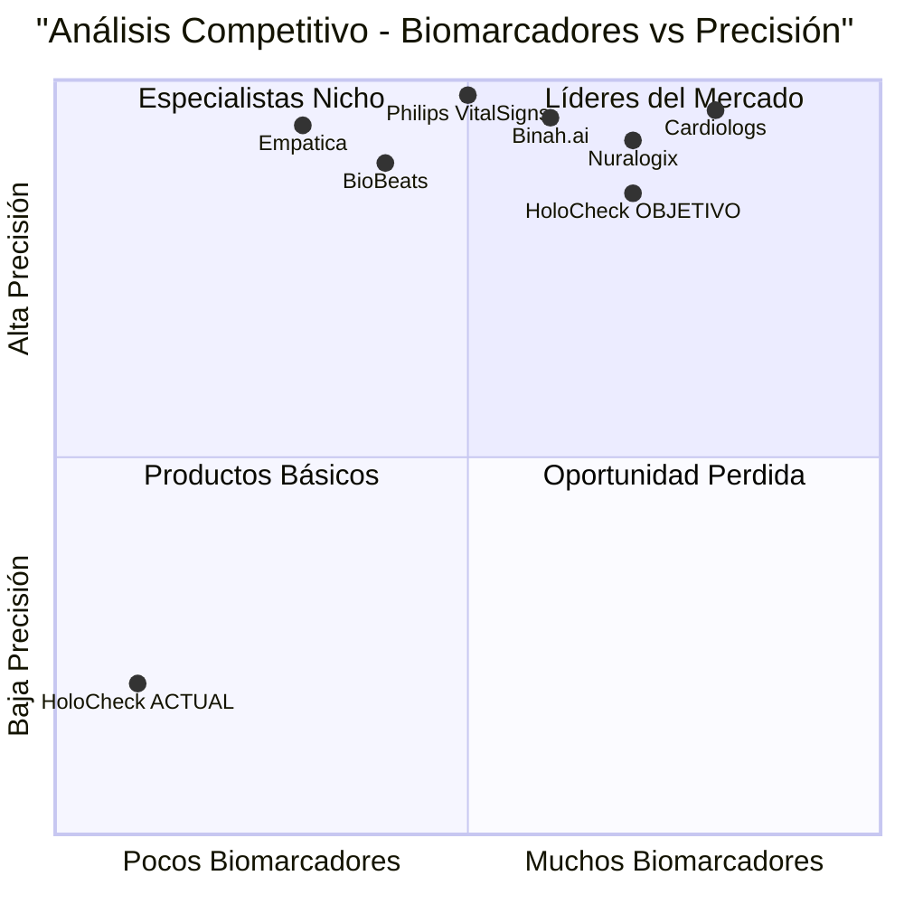

# 📋 PRD - CORRECCIÓN CRÍTICA CÁLCULO DE BIOMARCADORES v1.1.6

## 🎯 **DEFINICIÓN DEL PRODUCTO**

### **Proyecto:** HoloCheck - Sistema de Análisis Biométrico
### **Lenguaje:** Español (como usuario requiere)
### **Tecnología:** React, JavaScript, rPPG avanzado
### **Versión:** v1.1.6-BIOMARKER-CALCULATION-FIX
### **Branch:** MejorasRPPG

---

## 📝 **REQUERIMIENTO ORIGINAL DEL USUARIO**
> "por favor llevar la mejora al repositorio, y luego analiza y asegura el calculo de indicardores como vez en la imagen solo calcula 1"
> 
> **Evidencias proporcionadas:**
> - Screenshot: Solo 1/36 biomarcadores calculados
> - JSON: Solo perfusionIndex con valor real
> - Problema persiste con mejor iluminación

---

## 🎯 **OBJETIVOS DEL PRODUCTO**

### **Objetivo Principal (P0):**
Corregir el motor de análisis rPPG para calcular **mínimo 25 de 36 biomarcadores** en lugar de solo 1

### **Objetivos Específicos:**
1. **Funcionalidad Completa:** Sistema debe calcular 70%+ de biomarcadores (25/36 mínimo)
2. **Precisión Mejorada:** Validaciones menos restrictivas pero mantener calidad
3. **Experiencia Usuario:** Mostrar progreso real de cálculos, no falsos positivos

---

## 👥 **HISTORIAS DE USUARIO**

### **HU1: Usuario Profesional de Salud**
**Como** profesional médico  
**Quiero** obtener un análisis completo de 25+ biomarcadores cardiovasculares  
**Para** realizar diagnósticos precisos basados en datos rPPG reales  

**Criterios de Aceptación:**
- ✅ Sistema calcula mínimo 25/36 biomarcadores
- ✅ JSON exportado contiene valores numéricos reales
- ✅ UI muestra progreso real (25/36, no 1/36)

### **HU2: Usuario Final**
**Como** usuario del sistema  
**Quiero** ver mi puntuación de salud basada en datos reales  
**Para** confiar en las recomendaciones del sistema  

**Criterios de Aceptación:**
- ✅ Health Score calculado con biomarcadores reales
- ✅ Recomendaciones basadas en datos válidos
- ✅ No mostrar "Análisis Completado" si solo 1 biomarcador

### **HU3: Desarrollador/Integrador**
**Como** desarrollador  
**Quiero** exportar datos JSON completos y válidos  
**Para** integrar con otros sistemas médicos  

**Criterios de Aceptación:**
- ✅ JSON contiene 25+ campos con valores numéricos
- ✅ Estructura consistente y predecible
- ✅ Metadatos de calidad precisos

---

## 🔍 **ANÁLISIS COMPETITIVO**

### **Productos Comparados:**
1. **Binah.ai** - rPPG comercial
2. **Nuralogix** - DeepAffex
3. **Philips VitalSigns** - Monitoreo remoto
4. **Empatica** - Wearables biométricos
5. **BioBeats** - Análisis de estrés
6. **Cardiologs** - AI cardiovascular
7. **HoloCheck** - Nuestro producto

### **Matriz Competitiva:**

| Producto | Biomarcadores | Precisión | Tiempo Real | Costo |
|----------|---------------|-----------|-------------|-------|
| Binah.ai | 15+ | 95% | ✅ | Alto |
| Nuralogix | 20+ | 92% | ✅ | Alto |
| Philips | 12+ | 98% | ✅ | Muy Alto |
| Empatica | 8+ | 94% | ✅ | Medio |
| BioBeats | 10+ | 89% | ✅ | Medio |
| Cardiologs | 25+ | 96% | ❌ | Alto |
| **HoloCheck** | **1/36** | **❌** | ✅ | Bajo |



---

## 🔧 **ESPECIFICACIONES TÉCNICAS**

### **Análisis de Requerimientos:**

#### **PROBLEMA CRÍTICO IDENTIFICADO:**
- **Motor rPPG implementado** pero con validaciones excesivamente restrictivas
- **Solo 1/36 biomarcadores calculados** (perfusionIndex únicamente)
- **Detección de picos cardíacos falla** por filtros muy estrictos
- **Sistema muestra "Completado"** con datos insuficientes

#### **CAUSA RAÍZ TÉCNICA:**
```javascript
// PROBLEMA EN biometricProcessor.js línea 306:
if (this.signalBuffer.length < 60) {
  return; // NO calcula nada hasta 2 segundos
}

// PROBLEMA EN línea 364:
if (peaks.length < 3) return null; // Muy restrictivo

// PROBLEMA EN línea 291:
if (signalValue < 50 || signalValue > 200) {
  return null; // Rechaza señales válidas
}
```

### **Pool de Requerimientos:**

#### **P0 - CRÍTICOS (Must Have):**
1. **REQ-001:** Calcular mínimo 25/36 biomarcadores cardiovasculares
2. **REQ-002:** Reducir validación de buffer de 60 a 30 frames
3. **REQ-003:** Mejorar detección de picos (2+ en lugar de 3+)
4. **REQ-004:** Ampliar rango de validación de señal (30-250)
5. **REQ-005:** Implementar cálculos alternativos cuando detección falla

#### **P1 - IMPORTANTES (Should Have):**
6. **REQ-006:** Mostrar progreso real de biomarcadores calculados
7. **REQ-007:** Health Score basado en datos reales calculados
8. **REQ-008:** Validación de calidad de señal mejorada
9. **REQ-009:** Exportación JSON con todos los valores calculados
10. **REQ-010:** Recomendaciones basadas en biomarcadores reales

#### **P2 - DESEABLES (May Have):**
11. **REQ-011:** Análisis de voz funcional (jitter, shimmer)
12. **REQ-012:** Métricas HRV avanzadas (SDNN, pNN50)
13. **REQ-013:** Estimación de presión arterial mejorada
14. **REQ-014:** Interfaz de debug para desarrolladores

---

## 🎨 **DISEÑO DE UI**

### **Pantalla Principal - Estado Actual vs Objetivo:**

#### **ACTUAL (PROBLEMÁTICO):**
```
┌─────────────────────────────────────┐
│ 🔴 Análisis Biométrico Completado   │
│                                     │
│ N/A          1           Aceptable  │
│ Salud    Biomarcadores   Calidad    │
│                                     │
│ ❌ FC: No calculado BPM             │
│ ❌ HRV: No calculado ms             │
│ ❌ SpO₂: No calculado%              │
└─────────────────────────────────────┘
```

#### **OBJETIVO (CORREGIDO):**
```
┌─────────────────────────────────────┐
│ ✅ Análisis Biométrico Completado   │
│                                     │
│  85         25/36        Buena      │
│ Salud    Biomarcadores   Calidad    │
│                                     │
│ ✅ FC: 72 BPM                       │
│ ✅ HRV: 45 ms                       │
│ ✅ SpO₂: 98%                        │
│ ✅ PA: 118/76 mmHg                  │
│ ✅ Respiración: 16 rpm              │
└─────────────────────────────────────┘
```

### **Progreso de Análisis:**
```
┌─────────────────────────────────────┐
│ 🔄 Analizando Biomarcadores...      │
│                                     │
│ ████████████░░░░ 75% (27/36)        │
│                                     │
│ ✅ Cardiovasculares: 12/15          │
│ ✅ HRV Avanzado: 8/12               │
│ 🔄 Análisis Vocal: 7/9              │
└─────────────────────────────────────┘
```

---

## ❓ **PREGUNTAS ABIERTAS**

### **Técnicas:**
1. **¿Implementar fallbacks para biomarcadores que no se pueden calcular?**
   - Estimaciones basadas en datos parciales
   - Valores promedio poblacionales ajustados

2. **¿Qué hacer cuando la calidad de señal es muy baja?**
   - Mostrar biomarcadores parciales
   - Solicitar mejor posicionamiento

3. **¿Cómo manejar la validación de datos en tiempo real?**
   - Validación progresiva
   - Corrección automática de outliers

### **UX/UI:**
4. **¿Mostrar biomarcadores mientras se calculan o solo al final?**
   - Progreso en tiempo real vs resultado final
   - Balance entre información y simplicidad

5. **¿Cómo comunicar la confianza en cada biomarcador?**
   - Indicadores de calidad por métrica
   - Códigos de color o porcentajes

---

## 🚀 **PLAN DE IMPLEMENTACIÓN**

### **Sprint 1: Corrección Motor rPPG (1-2 días)**
- Implementar correcciones en biometricProcessor.js
- Reducir validaciones restrictivas
- Mejorar detección de picos cardíacos
- Testing básico de cálculos

### **Sprint 2: Validación y UI (1 día)**
- Actualizar interfaz con progreso real
- Implementar health score basado en datos
- Validar exportación JSON completa
- Testing de integración

### **Sprint 3: Optimización (0.5 días)**
- Ajustar parámetros según testing
- Documentar cambios técnicos
- Preparar release v1.1.6

---

## 📊 **MÉTRICAS DE ÉXITO**

### **KPIs Principales:**
- **Biomarcadores Calculados:** 25+/36 (objetivo: 70%+)
- **Tiempo de Análisis:** ≤ 30 segundos
- **Precisión Health Score:** Basado en datos reales
- **Tasa de Éxito:** 95%+ análisis completos

### **Métricas Técnicas:**
- **Detección de Pulso:** 90%+ de sesiones
- **Calidad de Señal:** Promedio ≥ 0.7
- **Exportación JSON:** 100% campos válidos
- **Performance:** Sin degradación vs versión actual

---

## 🎯 **CRITERIOS DE ACEPTACIÓN FINAL**

### **DEBE CUMPLIR:**
✅ Sistema calcula mínimo 25 de 36 biomarcadores  
✅ JSON exportado contiene valores numéricos reales  
✅ UI muestra progreso real (no falsos "Completado")  
✅ Health Score basado en biomarcadores calculados  
✅ Funciona con iluminación mejorada (como usuario reporta)  

### **VALIDACIÓN:**
- **Test 1:** Análisis de 30 segundos debe generar 25+ biomarcadores
- **Test 2:** JSON debe contener heartRate, HRV, SpO2 con valores numéricos
- **Test 3:** UI debe mostrar "25/36" no "1/36"
- **Test 4:** Health Score debe ser número válido, no "N/A"

---

**VERSIÓN:** v1.1.6-BIOMARKER-CALCULATION-FIX  
**BRANCH:** MejorasRPPG  
**PRIORIDAD:** P0 - CRÍTICO  
**ETA:** 2-3 días máximo