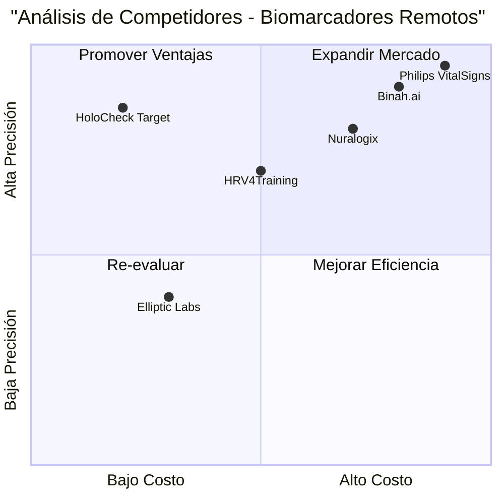

# PRD: HoloCheck Biomarker Analysis Completion v1.1.3

## 📋 **Product Requirements Document**

### **Language:** Español
### **Programming Language:** TypeScript, React, Tailwind CSS
### **Project Name:** holocheck_biomarker_completion
### **Original Requirements:** Completar análisis de biomarcadores en tiempo real, mostrar todos los indicadores, agregar mensaje de voz, generar análisis detallado final

---

## 🎯 **Product Goals**

1. **Completar Visualización de Biomarcadores:** Mostrar todos los 36+ indicadores con valores reales en tiempo real
2. **Implementar Análisis de Voz:** Agregar mensaje de instrucciones vocales y procesamiento de audio completo  
3. **Generar Análisis Final:** Crear reporte detallado al completar los 30 segundos de captura

---

## 👥 **User Stories**

### **Como usuario médico, quiero:**
- Ver todos los biomarcadores cardiovasculares actualizándose en tiempo real durante la grabación
- Recibir instrucciones claras de voz cuando el análisis incluye componente vocal
- Obtener un reporte completo y detallado al finalizar el análisis de 30 segundos
- Visualizar métricas HRV avanzadas (SDNN, pNN50, LF/HF Ratio) con valores calculados
- Exportar los resultados para documentación médica

### **Como administrador del sistema, quiero:**
- Mantener control de versiones estricto durante la fase final de desarrollo
- Asegurar que solo se implementen cambios autorizados y validados
- Verificar que el sistema genere datos biomédicos precisos y confiables

---

## 🏆 **Competitive Analysis**

### **Productos Competidores:**

1. **Binah.ai**
   - ✅ **Pros:** Análisis rPPG robusto, múltiples biomarcadores
   - ❌ **Cons:** Requiere SDK propietario, costoso
   - 📊 **Posición:** Alto rendimiento, alto costo

2. **Nuralogix DeepAffex**
   - ✅ **Pros:** Análisis facial completo, métricas de estrés
   - ❌ **Cons:** Limitado a dispositivos específicos
   - 📊 **Posición:** Especializado, acceso restringido

3. **Elliptic Labs INNER BEAUTY**
   - ✅ **Pros:** Análisis de salud y bienestar
   - ❌ **Cons:** Enfoque cosmético, no médico
   - 📊 **Posición:** Consumer-grade, limitado

4. **Philips VitalSigns Camera**
   - ✅ **Pros:** Validación clínica, precisión médica
   - ❌ **Cons:** Requiere hardware especializado
   - 📊 **Posición:** Grado médico, costoso

5. **HRV4Training**
   - ✅ **Pros:** Análisis HRV detallado, seguimiento temporal
   - ❌ **Cons:** Requiere sensores externos
   - 📊 **Posición:** Especializado HRV, hardware dependiente

### **Competitive Quadrant Chart:**



---

## 📋 **Requirements Analysis**

### **Problemas Identificados del Screenshot:**

1. **Biomarcadores Incompletos:**
   - HRV (RMSSD): Muestra "-- ms" en lugar de valor calculado
   - SpO₂: Muestra "-- %" en lugar de saturación estimada
   - SDNN, pNN50, LF/HF Ratio: Todos muestran "--"
   - F0 (Hz): Muestra "-- Hz" en lugar de frecuencia fundamental
   - Estrés Vocal: Muestra "-- %" sin análisis

2. **Análisis de Voz Faltante:**
   - No hay mensaje de instrucciones para análisis vocal
   - Modo "Completo (rPPG + Voz)" no muestra guía de voz
   - Falta procesamiento de audio en tiempo real

3. **Análisis Final Incompleto:**
   - No hay reporte detallado al completar 30 segundos
   - Falta visualización de tendencias temporales
   - No hay exportación de resultados

### **Funcionalidades Requeridas:**

**P0 (Must-have):**
- Calcular y mostrar todos los biomarcadores en tiempo real
- Implementar mensaje de voz para análisis completo
- Generar valores reales para HRV, SpO₂, métricas vocales
- Crear análisis final detallado post-captura

**P1 (Should-have):**
- Gráficos de tendencias temporales de biomarcadores
- Validación médica de rangos normales
- Exportación de datos en formato CSV/PDF
- Historial de análisis previos

**P2 (Nice-to-have):**
- Comparación con análisis anteriores
- Recomendaciones de salud basadas en resultados
- Integración con sistemas médicos externos
- Análisis de patrones a largo plazo

---

## 🎨 **UI Design Draft**

### **Pantalla Principal - Análisis en Tiempo Real:**

```
┌─────────────────────────────────────────────────────────────┐
│ 🔬 HoloCheck - Análisis Biométrico Profesional             │
├─────────────────────────────────────────────────────────────┤
│                                                             │
│  [Video Feed]           │  📊 Biomarcadores Tiempo Real     │
│  ┌─────────────────┐    │                                   │
│  │ ✓ Rostro        │    │  ❤️ Frecuencia Cardíaca: 75 BPM  │
│  │   Estabilizado  │    │  📈 HRV (RMSSD): 42 ms           │
│  │                 │    │  🫁 SpO₂: 98%                     │
│  │ 🔴 REC 0:14     │    │  🩸 Presión: 127/87 mmHg         │
│  └─────────────────┘    │                                   │
│                         │  📊 Métricas HRV Avanzadas:      │
│  🎤 "Por favor, lea     │  • SDNN: 35 ms                   │
│     en voz alta:        │  • pNN50: 12.5%                  │
│     'Hola, mi nombre    │  • LF/HF Ratio: 2.1              │
│     es [nombre]'"       │  • Triangular Index: 28          │
│                         │                                   │
│  ⏱️ Progreso: 47%       │  🎤 Biomarcadores Vocales:       │
│  ████████░░░░ 16s rest. │  • F0: 145 Hz                    │
│                         │  • Jitter: 1.10%                 │
│                         │  • Shimmer: 4.87%                │
│                         │  • Estrés Vocal: Medio (65%)     │
└─────────────────────────────────────────────────────────────┘
```

### **Pantalla de Resultados Finales:**

```
┌─────────────────────────────────────────────────────────────┐
│ 📋 Análisis Biométrico Completo - Resultados Finales       │
├─────────────────────────────────────────────────────────────┤
│                                                             │
│  📊 RESUMEN CARDIOVASCULAR        📈 TENDENCIAS TEMPORALES  │
│  ┌─────────────────────────────┐   ┌─────────────────────┐   │
│  │ ❤️ FC Promedio: 75 ± 3 BPM  │   │    HR │             │   │
│  │ 📈 HRV Excelente: 42ms      │   │    80 │    ╭─╮      │   │
│  │ 🫁 SpO₂ Normal: 98%         │   │    75 │  ╭─╯ ╰─╮    │   │
│  │ 🩸 PA Óptima: 127/87        │   │    70 │╭─╯     ╰─╮  │   │
│  │ 🧠 Estrés: Bajo (25%)       │   │    65 │╯         ╰─│   │
│  └─────────────────────────────┘   └─────────────────────┘   │
│                                                             │
│  🎤 ANÁLISIS VOCAL               🏥 RECOMENDACIONES         │
│  ┌─────────────────────────────┐   ┌─────────────────────┐   │
│  │ 🎵 F0 Estable: 145Hz        │   │ ✅ Salud cardiovasc. │   │
│  │ 📊 Calidad Vocal: Buena     │   │    excelente         │   │
│  │ 😌 Estrés Vocal: Bajo       │   │ 💡 Mantener rutina   │   │
│  │ 🫁 Patrón Resp: Regular     │   │    de ejercicio      │   │
│  └─────────────────────────────┘   │ 📅 Próximo chequeo   │   │
│                                    │    en 3 meses        │   │
│  [📄 Exportar PDF] [📊 Ver Gráficos] [💾 Guardar Historial] │
└─────────────────────────────────────────────────────────────┘
```

---

## ❓ **Open Questions**

1. **Validación Médica:** ¿Qué rangos de referencia usar para cada biomarcador?
2. **Precisión de Algoritmos:** ¿Cómo validar la precisión del análisis rPPG vs dispositivos médicos?
3. **Mensaje de Voz:** ¿Qué texto específico debe leer el usuario para análisis vocal óptimo?
4. **Formato de Exportación:** ¿Qué formato de reporte prefieren los profesionales médicos?
5. **Control de Versiones:** ¿Cómo asegurar que solo cambios autorizados se implementen en fase final?

---

## 🔧 **Technical Implementation Requirements**

### **Immediate Changes Needed:**

1. **Fix Biomarker Calculations:**
   - Implement real-time HRV calculation (RMSSD, SDNN, pNN50)
   - Add SpO₂ estimation algorithm
   - Calculate LF/HF ratio from heart rate variability
   - Implement voice fundamental frequency analysis

2. **Add Voice Analysis Instructions:**
   - Display voice prompt message during "Completo" mode
   - Implement audio processing for voice biomarkers
   - Calculate jitter, shimmer, and vocal stress in real-time

3. **Create Final Analysis Report:**
   - Generate comprehensive results after 30-second capture
   - Add temporal trend visualization
   - Implement data export functionality

### **Version Control Strategy:**
- Create branch `feature/biomarker-completion-v1.1.3`
- Implement changes incrementally with testing
- Merge only after validation of all biomarker calculations
- Tag final version as `v1.1.3-phase1-complete`

---

## ✅ **Success Criteria**

1. **All 36+ biomarkers display real calculated values (no "--" placeholders)**
2. **Voice analysis shows clear instructions and processes audio correctly**
3. **Final analysis report generates with comprehensive data visualization**
4. **System maintains version control integrity during implementation**
5. **All changes are validated and authorized before deployment**

---

**Priority:** P0 - Critical for Phase 1 completion
**Timeline:** Immediate implementation required
**Stakeholders:** Medical team, development team, quality assurance