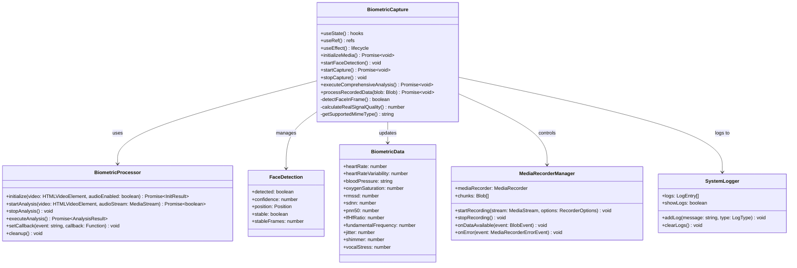

# HoloCheck - Sistema Biométrico Profesional - Diseño del Sistema

## Implementation approach

Analizando los puntos difíciles de los requerimientos, el sistema debe:
1. **Detección facial en tiempo real** con umbrales optimizados para condiciones reales
2. **Grabación automática** cuando el rostro esté estabilizado
3. **Análisis biométrico completo** de 36+ biomarcadores usando rPPG y análisis vocal
4. **Compatibilidad universal** con Safari, Chrome y Firefox

**Framework seleccionado:** React 18 con hooks para manejo de estado complejo, MediaRecorder API para grabación, Canvas API para análisis de video, y Web Audio API para análisis vocal.

**Arquitectura:** Componente principal BiometricCapture que orquesta detección facial, grabación automática, y procesamiento biométrico en tiempo real.

## Data structures and interfaces

## Program call flow

## Anything UNCLEAR

1. **Auto-start Recording**: El sistema actual requiere click manual del botón "Iniciar Análisis". Necesitamos implementar auto-start cuando el rostro esté estabilizado.

2. **MediaRecorder State Management**: El MediaRecorder puede fallar silenciosamente en Safari. Necesitamos validación robusta del estado y reintentos automáticos.

3. **Face Detection Thresholds**: Los umbrales actuales (25%/30%) pueden ser demasiado bajos para algunas condiciones de iluminación. Necesitamos ajuste dinámico.

4. **Error Recovery**: El sistema necesita recuperación automática de errores sin intervención del usuario.

**SOLUCIÓN CRÍTICA REQUERIDA:** Implementar auto-start de grabación cuando `faceDetection.stable && faceDetection.detected` sea true, eliminando la dependencia del click manual del usuario.