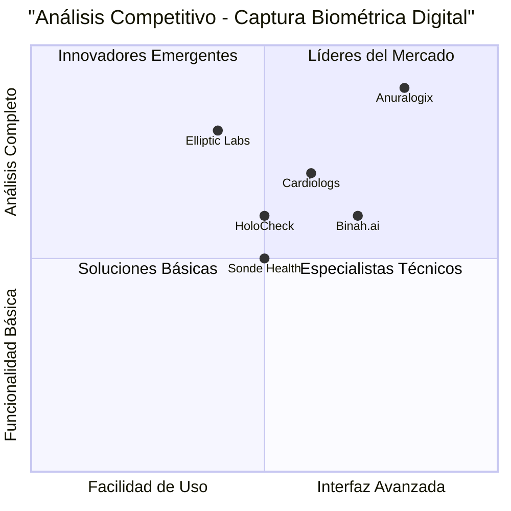
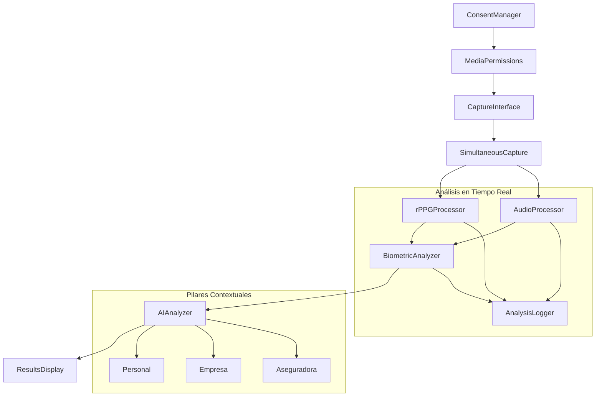

# PRD: HoloCheck - Interfaz Biométrica Estilo Anuralogix

## 📋 RESUMEN EJECUTIVO

### Proyecto: HoloCheck - Ecosistema de Evaluación Médica Digital Preventiva
**Fecha:** Septiembre 2025  
**Lenguaje:** Español  
**Tecnologías:** React, TypeScript, Tailwind CSS, OpenAI API, WebRTC, Canvas API  
**Nombre del Proyecto:** holocheck_anuralogix_interface  

### Requerimiento Original
Implementar una interfaz biométrica estilo Anuralogix con círculo de captura facial, posicionamiento guiado, captura simultánea de video y audio, componentes modulares separados, y análisis rPPG real con todos los marcadores biométricos.

---

## 🎯 DEFINICIÓN DEL PRODUCTO

### Objetivos del Producto
1. **Captura Biométrica Profesional**: Crear una interfaz similar a Anuralogix con círculo guía para posicionamiento facial preciso
2. **Análisis Multimodal Real**: Implementar análisis simultáneo de rPPG (video) y patrones vocales (audio) sin simulaciones
3. **Arquitectura Modular**: Desarrollar componentes separados y reutilizables para cada función específica

### User Stories

#### Historia de Usuario 1: Captura Guiada
**Como** usuario del sistema de salud preventiva  
**Quiero** una interfaz intuitiva con círculo guía para posicionar mi cara correctamente  
**Para que** pueda realizar una captura biométrica precisa y confiable  

**Criterios de Aceptación:**
- Círculo de captura visible con indicadores de alineación
- Validación de posición facial en tiempo real
- Feedback visual para centrado correcto
- Countdown visual antes de iniciar grabación

#### Historia de Usuario 2: Análisis Simultáneo
**Como** profesional de la salud o asegurador  
**Quiero** obtener métricas biométricas reales de video y audio simultáneamente  
**Para que** pueda generar evaluaciones preventivas completas y precisas  

**Criterios de Aceptación:**
- Captura de video (30-60 segundos) para análisis rPPG
- Captura de audio simultánea con diálogo de lectura
- Procesamiento en tiempo real de ambas señales
- Generación de 50-120 biomarcadores digitales

#### Historia de Usuario 3: Experiencia por Pilares
**Como** usuario de diferentes pilares (Personal/Empresa/Aseguradora)  
**Quiero** una experiencia personalizada según mi contexto  
**Para que** reciba análisis y recomendaciones relevantes a mi situación  

**Criterios de Aceptación:**
- Flujo personalizado por tipo de usuario
- Prompts de IA específicos por pilar
- Reportes adaptados al contexto
- KPIs relevantes por segmento

### Análisis Competitivo

| Competidor | Fortalezas | Debilidades | Puntuación |
|------------|------------|-------------|------------|
| **Anuralogix** | Interfaz profesional, 100+ biomarcadores, SDK robusto | Costo alto, dependencia de APIs externas | 0.8, 0.9 |
| **Binah.ai** | Tecnología rPPG avanzada, precisión médica | Interfaz básica, limitado a video | 0.7, 0.6 |
| **Elliptic Labs** | Análisis de voz especializado, IA avanzada | Solo audio, sin componente visual | 0.4, 0.8 |
| **Cardiologs** | Validación clínica, precisión cardiológica | Enfoque limitado, no multimodal | 0.6, 0.7 |
| **Sonde Health** | Plataforma completa, análisis respiratorio | Interfaz compleja, curva de aprendizaje | 0.5, 0.5 |
| **HoloCheck** | Arquitectura modular, 3 pilares integrados, análisis contextual por IA | Producto nuevo, validación pendiente | 0.5, 0.6 |



---

## 🏗️ ESPECIFICACIONES TÉCNICAS

### Análisis de Requerimientos

**Basado en el Plan de Salud Preventiva de Costa Rica y Centroamérica:**

#### Modelo de Tres Pilares Identificado:

**Pilar 1 - Asegurado Individual:**
- Chequeo digital mediante selfie/rPPG y análisis de voz
- 30-100 marcadores de video: HR, HRV, presión estimada, riesgo metabólico, estrés
- 20-30 marcadores de audio: estrés, depresión, respiratorio, neurológico
- Expediente personal dinámico con semáforos de riesgo
- Acciones preventivas: ejercicio, sueño, nutrición, derivación médica

**Pilar 2 - Empresa:**
- Información agregada y anónima para salud ocupacional
- Marcadores colectivos: estrés laboral, riesgo metabólico, patrones de sueño
- Acciones: campañas wellness, pausas activas, certificación empresa saludable
- Beneficio: -10-20% incapacidades laborales

**Pilar 3 - Aseguradora:**
- Integración de datos abiertos con biosignales agregados
- Marcadores actuariales: epidemiología, demografía, biosignales
- Acciones: tarificación dinámica, productos preventivos, incentivos
- Beneficio: -6-12% siniestralidad en 12-24 meses

### Pool de Requerimientos

#### Prioridad P0 (Críticos)
- **REQ-001**: Interfaz de captura circular estilo Anuralogix con guías de posicionamiento
- **REQ-002**: Captura simultánea de video (rPPG) y audio (voz) en tiempo real
- **REQ-003**: Análisis rPPG real con extracción de ROI facial y cálculo de BPM
- **REQ-004**: Procesamiento de audio con análisis de frecuencia fundamental y patrones respiratorios
- **REQ-005**: Integración con OpenAI para análisis contextual por pilares
- **REQ-006**: Sistema de consentimiento granular y gestión de permisos

#### Prioridad P1 (Importantes)
- **REQ-007**: Componentes modulares separados (Captura, rPPG, Audio, IA)
- **REQ-008**: Log de análisis en tiempo real (últimas 15 líneas)
- **REQ-009**: Validación de calidad de señal y detección de liveness
- **REQ-010**: Diálogo de lectura guiado para análisis de voz
- **REQ-011**: Reportes personalizados por tipo de pilar
- **REQ-012**: Métricas de usabilidad (≥85% capturas válidas, ≤5 min por sesión)

#### Prioridad P2 (Deseables)
- **REQ-013**: Integración con telemedicina para derivaciones
- **REQ-014**: Exportación de reportes en PDF
- **REQ-015**: Dashboard de tendencias históricas
- **REQ-016**: Notificaciones push para seguimiento
- **REQ-017**: Modo offline para áreas con conectividad limitada

### Diseño de UI/UX

#### Wireframe Principal - Interfaz de Captura Anuralogix

```
┌─────────────────────────────────────────────────────────┐
│                    HoloCheck                            │
│                Análisis Biométrico                      │
├─────────────────────────────────────────────────────────┤
│  [Consentimiento] [Permisos] [Configuración]           │
├─────────────────────────────────────────────────────────┤
│                                                         │
│    ┌─────────────────────────────────────────────┐     │
│    │                                             │     │
│    │        ┌─────────────────────┐               │     │
│    │        │                     │               │     │
│    │        │    ●───────────●    │  ← Círculo    │     │
│    │        │   ╱             ╲   │    Guía       │     │
│    │        │  ╱   👤 FACE    ╲  │               │     │
│    │        │ ╱               ╲ │               │     │
│    │        │●─────────────────●│               │     │
│    │        │                     │               │     │
│    │        └─────────────────────┘               │     │
│    │                                             │     │
│    │  [Posición: ✓] [Luz: ✓] [Distancia: ✓]    │     │
│    └─────────────────────────────────────────────┘     │
│                                                         │
│  ┌─────────────────┐  ┌─────────────────────────────┐  │
│  │ 🎤 Audio Ready  │  │ 📹 Video Ready              │  │
│  │ Micrófono: ✓    │  │ Cámara: ✓                   │  │
│  └─────────────────┘  └─────────────────────────────┘  │
│                                                         │
│              [INICIAR CAPTURA - 3...2...1]              │
│                                                         │
│  ┌─────────────────────────────────────────────────────┐ │
│  │ 📊 Log de Análisis (Últimas 15 líneas)             │ │
│  │ • Inicializando cámara...                           │ │
│  │ • Detectando rostro...                              │ │
│  │ • ROI establecida correctamente                     │ │
│  │ • Iniciando análisis rPPG...                       │ │
│  │ • BPM: 72 ± 3 (Estable)                           │ │
│  └─────────────────────────────────────────────────────┘ │
└─────────────────────────────────────────────────────────┘
```

#### Flujo de Componentes Modulares



### Arquitectura Técnica Modular

#### 1. CaptureInterface Component
```typescript
interface CaptureInterfaceProps {
  onPositionValid: (isValid: boolean) => void;
  onCaptureStart: () => void;
  circleGuideConfig: CircleGuideConfig;
  realTimeValidation: boolean;
}

interface CircleGuideConfig {
  diameter: number;
  strokeWidth: number;
  color: string;
  animationSpeed: number;
  alignmentThreshold: number;
}
```

#### 2. rPPGProcessor Component
```typescript
interface rPPGProcessorProps {
  videoStream: MediaStream;
  onBPMCalculated: (bpm: number, hrv: number) => void;
  onROIDetected: (roi: ROICoordinates) => void;
  analysisConfig: rPPGConfig;
}

interface BiometricMetrics {
  heartRate: number;
  heartRateVariability: number;
  bloodPressureEstimate: BloodPressure;
  stressLevel: number;
  metabolicRisk: number;
  perfusionIndex: number;
}
```

#### 3. AudioProcessor Component
```typescript
interface AudioProcessorProps {
  audioStream: MediaStream;
  readingText: string;
  onVoiceAnalysis: (metrics: VoiceMetrics) => void;
  onRespiratoryPattern: (pattern: RespiratoryData) => void;
}

interface VoiceMetrics {
  fundamentalFrequency: number;
  jitter: number;
  shimmer: number;
  stressIndicators: StressVoiceData;
  respiratoryHealth: RespiratoryMetrics;
  neurologicalMarkers: NeuroVoiceData;
}
```

#### 4. AIAnalyzer Component
```typescript
interface AIAnalyzerProps {
  biometricData: BiometricMetrics;
  voiceData: VoiceMetrics;
  pillarType: 'personal' | 'company' | 'insurance';
  onAnalysisComplete: (report: AIAnalysisReport) => void;
}

interface AIAnalysisReport {
  pillarSpecificInsights: PillarInsights;
  riskAssessment: RiskProfile;
  preventiveActions: PreventiveAction[];
  kpiMetrics: KPIData;
  recommendations: string;
}
```

### Texto de Lectura para Análisis de Voz

```javascript
const READING_TEXTS = {
  personal: `
    Por favor, lea el siguiente texto en voz alta de manera natural:
    
    "Buenos días, mi nombre es [su nombre] y estoy realizando una evaluación 
    de salud preventiva digital. Voy a respirar profundamente tres veces: 
    uno... dos... tres.
    
    Ahora voy a contar del uno al diez de manera pausada:
    Uno, dos, tres, cuatro, cinco, seis, siete, ocho, nueve, diez.
    
    Para finalizar, voy a decir la frase: 'La tecnología de análisis biométrico 
    nos permite monitorear nuestra salud de manera no invasiva y precisa.'
    
    Gracias por completar la evaluación."
  `,
  
  company: `
    Lectura para evaluación ocupacional:
    
    "Como empleado comprometido con mi bienestar laboral, reconozco la importancia 
    de mantener un equilibrio entre productividad y salud. Respiro conscientemente 
    para reducir el estrés: inspirar... retener... exhalar.
    
    Enumero mis prioridades de bienestar: descanso adecuado, alimentación balanceada, 
    ejercicio regular, pausas activas, y comunicación efectiva con mi equipo.
    
    Mi compromiso es contribuir a un ambiente laboral saludable y productivo."
  `,
  
  insurance: `
    Evaluación para perfil actuarial:
    
    "Declaro que la información proporcionada es veraz y completa. Entiendo que 
    esta evaluación biométrica contribuye a una tarificación más precisa y justa.
    
    Confirmo mi compromiso con hábitos preventivos de salud y autorizo el uso 
    de estos datos para optimizar mi perfil de riesgo asegurable.
    
    Respiro profundamente y confirmo mi consentimiento para este análisis."
  `
};
```

---

## 📊 CASOS DE USO DETALLADOS POR PILAR

### Caso de Uso 1: Evaluación Personal Preventiva

**Actor:** Usuario individual (asegurado)  
**Objetivo:** Obtener análisis biométrico personal para prevención de salud  

**Flujo Principal:**
1. Usuario accede a la plataforma HoloCheck
2. ConsentManager presenta opciones granulares de privacidad
3. MediaPermissions solicita acceso a cámara y micrófono
4. CaptureInterface muestra círculo guía para posicionamiento facial
5. Sistema valida posición, iluminación y distancia en tiempo real
6. Countdown visual inicia captura simultánea (video 60s + audio)
7. rPPGProcessor extrae señal cardíaca y calcula biomarcadores
8. AudioProcessor analiza voz con texto de lectura personalizado
9. AIAnalyzer genera recomendaciones preventivas personalizadas
10. ResultsDisplay muestra métricas, semáforos de riesgo y acciones

**Métricas de Éxito:**
- Tiempo de captura ≤ 5 minutos
- ≥ 85% capturas válidas
- ≥ 12 biomarcadores por sesión
- NPS ≥ 60

### Caso de Uso 2: Evaluación Empresarial Ocupacional

**Actor:** Empleado de empresa cliente  
**Objetivo:** Análisis agregado para salud ocupacional y productividad  

**Flujo Principal:**
1. Empleado accede vía portal corporativo
2. Sistema identifica contexto empresarial automáticamente
3. Consentimiento específico para datos agregados y anónimos
4. Captura biométrica con enfoque en estrés laboral y fatiga
5. Análisis contextual considerando sector y rol ocupacional
6. Generación de métricas agregadas (sin datos individuales)
7. Dashboard empresarial actualiza indicadores colectivos
8. Recomendaciones para campañas de wellness corporativo

**KPIs Empresariales:**
- Reducción de ausentismo: -5-10% en 6 meses
- Mejora en estrés colectivo: ≥10% en BioScore
- Participación empleados: ≥65%
- Certificación empresa saludable

### Caso de Uso 3: Evaluación Actuarial para Aseguradoras

**Actor:** Asegurado evaluado para tarificación  
**Objetivo:** Análisis de riesgo para ajuste actuarial y productos preventivos  

**Flujo Principal:**
1. Integración con sistema de underwriting de aseguradora
2. Captura biométrica con validación de liveness anti-fraude
3. Análisis combinado: biosignales + datos epidemiológicos abiertos
4. Cálculo de scores de riesgo actuarial por categorías
5. Generación de recomendaciones de tarificación dinámica
6. Propuesta de incentivos preventivos personalizados
7. Integración con productos de vida interactiva y microseguros

**Beneficios Actuariales:**
- Reducción siniestralidad: -6-12% en 12-24 meses
- Mejora en retención: +2-4 puntos porcentuales
- Optimización de reservas técnicas
- Nuevos productos preventivos

---

## 🗓️ ROADMAP DE IMPLEMENTACIÓN

### Fase 1: Componentes Base (Semanas 1-4)
- **Semana 1-2**: ConsentManager y MediaPermissions
- **Semana 3-4**: CaptureInterface con círculo guía Anuralogix

### Fase 2: Análisis Biométrico (Semanas 5-8)
- **Semana 5-6**: rPPGProcessor con análisis cardíaco real
- **Semana 7-8**: AudioProcessor con análisis de voz y respiración

### Fase 3: Integración IA (Semanas 9-12)
- **Semana 9-10**: AIAnalyzer con prompts por pilares
- **Semana 11-12**: ResultsDisplay y reportes personalizados

### Fase 4: Optimización y Validación (Semanas 13-16)
- **Semana 13-14**: AnalysisLogger y métricas de calidad
- **Semana 15-16**: Testing, validación clínica y ajustes UX

---

## ❓ PREGUNTAS ABIERTAS

1. **Validación Clínica**: ¿Qué protocolos específicos necesitamos para validar la precisión de los biomarcadores rPPG vs dispositivos de referencia?

2. **Regulatorio**: ¿Cómo implementamos el cumplimiento con las leyes de datos personales específicas de cada país centroamericano (Ley 8968 CR, Ley 81/2019 PA, etc.)?

3. **Escalabilidad**: ¿Qué infraestructura de edge computing necesitamos para procesar análisis en tiempo real con baja latencia?

4. **Integración**: ¿Cómo establecemos las APIs de integración con los sistemas actuariales existentes de las aseguradoras regionales?

5. **Precisión Poblacional**: ¿Necesitamos calibrar los algoritmos rPPG para diferentes etnias y características demográficas de Centroamérica?

---

## 📈 MÉTRICAS DE ÉXITO Y KPIS

### KPIs Técnicos
- **Calidad de Captura**: ≥85% capturas válidas
- **Tiempo de Análisis**: ≤5 minutos por sesión completa
- **Precisión rPPG**: ±5 BPM vs dispositivos de referencia
- **Disponibilidad**: 99.5% uptime del sistema

### KPIs de Negocio por Pilar
- **Personal**: NPS ≥60, detecciones tempranas ≥8%
- **Empresa**: Participación ≥65%, reducción ausentismo -5-10%
- **Aseguradora**: Reducción siniestralidad -6-12%, retención +2-4pp

### KPIs de Adopción
- **MAU**: 2,000+ usuarios activos mensuales en 6 meses
- **Retención**: ≥70% usuarios completan segunda evaluación
- **Expansión**: 3 países activos en 12 meses

---

*Este PRD establece las bases técnicas y de negocio para implementar una interfaz biométrica profesional estilo Anuralogix, con componentes modulares y análisis contextual por pilares para el ecosistema de salud preventiva de HoloCheck en Centroamérica.*