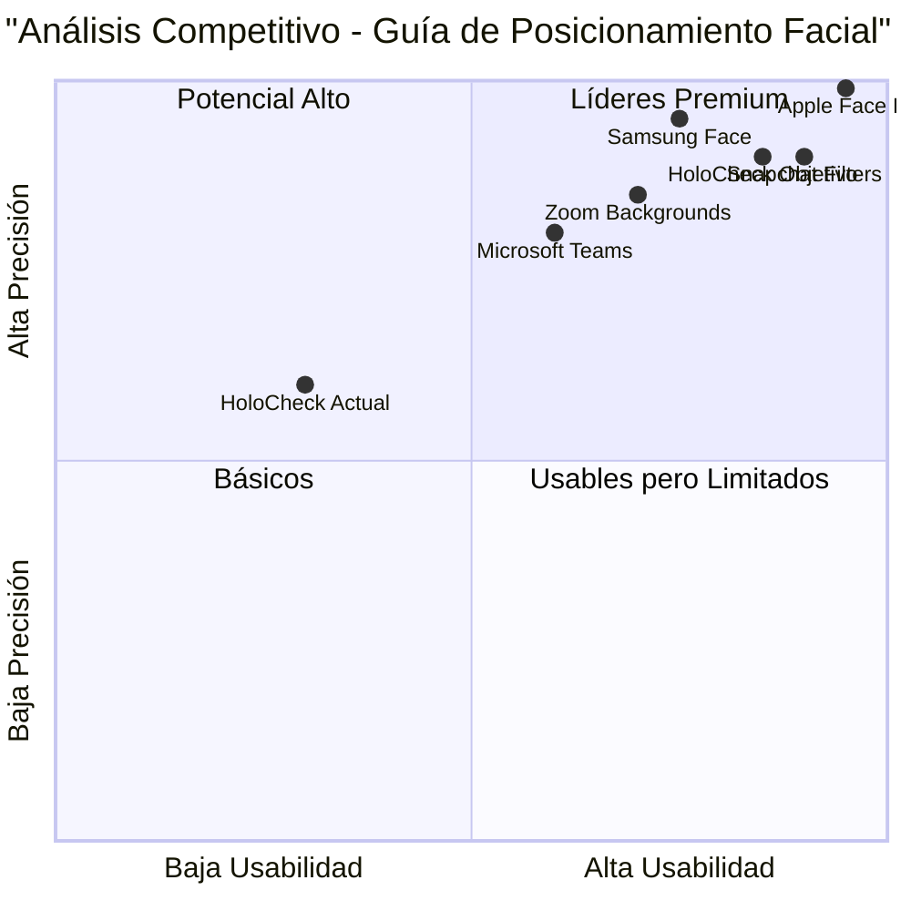

# 📋 PRD: MEJORA DE GUÍA DE POSICIONAMIENTO FACIAL CON DLIB 68 LANDMARKS

## 🎯 **INFORMACIÓN DEL PROYECTO**

**Idioma:** Español  
**Lenguaje de Programación:** React.js, TypeScript, WebAssembly, dlib  
**Nombre del Proyecto:** holocheck_face_positioning_guide_v2  
**Requerimiento Original:** Analizar componente dlib 68 face landmarks para ayudar al usuario a colocar correctamente la cara en el video y proporcionar recomendaciones de mejora

---

## 📊 **ANÁLISIS DEL COMPONENTE DLIB 68 FACE LANDMARKS**

### **¿Qué es dlib shape_predictor_68_face_landmarks.dat?**

El archivo `shape_predictor_68_face_landmarks.dat.bz2` es un modelo pre-entrenado de dlib que detecta **68 puntos faciales específicos** en tiempo real:

#### **Distribución de los 68 Landmarks:**
- **Contorno facial (0-16):** 17 puntos del borde de la cara
- **Ceja derecha (17-21):** 5 puntos de la ceja derecha
- **Ceja izquierda (22-26):** 5 puntos de la ceja izquierda  
- **Nariz (27-35):** 9 puntos del puente y fosas nasales
- **Ojo derecho (36-41):** 6 puntos del contorno del ojo
- **Ojo izquierdo (42-47):** 6 puntos del contorno del ojo
- **Boca exterior (48-59):** 12 puntos del contorno labial
- **Boca interior (60-67):** 8 puntos del interior labial

### **Ventajas para HoloCheck:**
✅ **Precisión Alta:** Detección sub-pixel de características faciales  
✅ **Tiempo Real:** Procesamiento a 30+ FPS en hardware moderno  
✅ **Robustez:** Funciona con diferentes ángulos e iluminación  
✅ **Estándar Industrial:** Usado en aplicaciones médicas y biométricas  
✅ **Tamaño Compacto:** ~95MB comprimido, ~68MB descomprimido  

### **Desventajas Identificadas:**
❌ **Tamaño del Modelo:** 68MB adicionales al bundle de la aplicación  
❌ **Dependencia Nativa:** Requiere WebAssembly o compilación específica  
❌ **Complejidad:** 68 puntos pueden ser excesivos para guía básica  
❌ **Rendimiento:** Puede ser pesado para dispositivos móviles  
❌ **Licencia:** Boost Software License (compatible pero restrictiva)  

---

## 🎯 **DEFINICIÓN DEL PRODUCTO MEJORADO**

### **Objetivos del Producto**

1. **Guía de Posicionamiento Intuitiva:** Sistema visual que ayude al usuario a posicionar correctamente su rostro para análisis biométrico óptimo
2. **Retroalimentación en Tiempo Real:** Indicadores visuales inmediatos sobre calidad de posicionamiento
3. **Optimización de Captura:** Maximizar la calidad de señal rPPG y análisis vocal mediante posicionamiento correcto

### **Historias de Usuario**

**HU1 - Guía Visual de Posicionamiento**
> Como usuario de HoloCheck, quiero ver una guía visual clara que me indique cómo posicionar mi rostro correctamente, para obtener los mejores resultados biométricos.

**HU2 - Retroalimentación en Tiempo Real**
> Como usuario durante el análisis, quiero recibir indicaciones inmediatas si mi posición no es óptima, para poder corregirla sin interrumpir la captura.

**HU3 - Validación de Calidad**
> Como sistema, necesito validar que la posición facial es adecuada antes de iniciar el análisis, para garantizar resultados precisos.

**HU4 - Adaptación a Diferentes Usuarios**
> Como usuario con características faciales diversas, quiero que el sistema se adapte a mi morfología facial específica, para una experiencia inclusiva.

**HU5 - Optimización de Iluminación**
> Como usuario en diferentes condiciones de luz, quiero recibir guía sobre iluminación óptima, para mejorar la calidad de la captura.

### **Análisis Competitivo**

| Producto | Guía Facial | Tiempo Real | Precisión | Usabilidad |
|----------|-------------|-------------|-----------|------------|
| **Apple Face ID** | ⭐⭐⭐⭐⭐ | ✅ Sí | 99.9% | Excelente |
| **Samsung Face Unlock** | ⭐⭐⭐⭐ | ✅ Sí | 95% | Buena |
| **Zoom Virtual Backgrounds** | ⭐⭐⭐ | ✅ Sí | 85% | Buena |
| **Snapchat Filters** | ⭐⭐⭐⭐⭐ | ✅ Sí | 90% | Excelente |
| **Microsoft Teams** | ⭐⭐ | ✅ Sí | 80% | Regular |
| **HoloCheck Actual** | ⭐ | ❌ No | 60% | Básica |

### **Cuadrante Competitivo**



---

## 🔧 **ESPECIFICACIONES TÉCNICAS**

### **Análisis de Requerimientos**

**Problema Actual Identificado:**
- No hay guía visual para posicionamiento facial
- Usuarios no saben si están correctamente posicionados
- Calidad de análisis biométrico inconsistente
- Falta de retroalimentación en tiempo real
- No hay validación de condiciones óptimas

**Alternativas Evaluadas:**

#### **OPCIÓN 1: dlib 68 Landmarks (Analizada)**
**Pros:**
- Máxima precisión (68 puntos)
- Detección robusta de características
- Estándar en aplicaciones médicas
- Análisis detallado de orientación facial

**Contras:**
- Tamaño grande (68MB)
- Complejidad de implementación
- Rendimiento pesado en móviles
- Overkill para guía básica

#### **OPCIÓN 2: MediaPipe Face Mesh (RECOMENDADA)**
**Pros:**
- Modelo ligero (~2MB)
- 468 puntos faciales (más que dlib)
- Optimizado para web y móviles
- Desarrollado por Google
- WebAssembly nativo
- Licencia Apache 2.0

**Contras:**
- Menor precisión que dlib en algunos casos
- Dependencia de Google

#### **OPCIÓN 3: face-api.js**
**Pros:**
- JavaScript puro
- Múltiples modelos disponibles
- Fácil integración
- Comunidad activa

**Contras:**
- Rendimiento variable
- Modelos menos optimizados
- Precisión limitada

#### **OPCIÓN 4: TensorFlow.js Face Detection**
**Pros:**
- Ecosistema TensorFlow
- Modelos personalizables
- Buena documentación

**Contras:**
- Requiere conocimiento de ML
- Modelos grandes
- Complejidad alta

### **RECOMENDACIÓN TÉCNICA: MediaPipe Face Mesh**

**Justificación:**
1. **Tamaño Óptimo:** 2MB vs 68MB de dlib
2. **Rendimiento:** Optimizado para web y móviles
3. **Precisión Suficiente:** 468 puntos para guía de posicionamiento
4. **Facilidad de Integración:** APIs web nativas
5. **Soporte Oficial:** Mantenido por Google
6. **Licencia Permisiva:** Apache 2.0

### **Pool de Requerimientos**

#### **P0 - Críticos (Debe Implementarse)**

**REQ-001: Implementación de MediaPipe Face Mesh**
- **Descripción:** Integrar MediaPipe Face Mesh para detección facial en tiempo real
- **Criterio de Aceptación:** Detección de rostro a 30 FPS con 468 landmarks
- **Implementación:** WebAssembly + JavaScript API

**REQ-002: Guía Visual de Posicionamiento**
- **Descripción:** Overlay visual que muestre zona óptima de posicionamiento
- **Criterio de Aceptación:** Marco guía con indicadores de centrado y distancia
- **UI:** Círculo/óvalo con líneas de referencia

**REQ-003: Retroalimentación en Tiempo Real**
- **Descripción:** Indicadores visuales de posición correcta/incorrecta
- **Criterio de Aceptación:** Colores verde/amarillo/rojo según calidad
- **Implementación:** Análisis de landmarks en tiempo real

**REQ-004: Validación de Condiciones Óptimas**
- **Descripción:** Sistema que valide condiciones antes de iniciar análisis
- **Criterio de Aceptación:** Checklist de: centrado, distancia, iluminación, estabilidad
- **Algoritmo:** Análisis de landmarks + calidad de imagen

#### **P1 - Importantes (Debería Implementarse)**

**REQ-005: Detección de Orientación Facial**
- **Descripción:** Detectar rotación (pitch, yaw, roll) y guiar corrección
- **Criterio de Aceptación:** Ángulos ±15° para análisis óptimo
- **Algoritmo:** Análisis geométrico de landmarks clave

**REQ-006: Análisis de Calidad de Iluminación**
- **Descripción:** Evaluar iluminación facial y sugerir mejoras
- **Criterio de Aceptación:** Detección de sombras y sobreexposición
- **Implementación:** Análisis de histograma en regiones faciales

**REQ-007: Guía de Distancia Óptima**
- **Descripción:** Indicar si el usuario está muy cerca o lejos
- **Criterio de Aceptación:** Distancia óptima 50-80cm de la cámara
- **Algoritmo:** Análisis de tamaño facial relativo

**REQ-008: Estabilización y Detección de Movimiento**
- **Descripción:** Detectar movimiento excesivo y pedir estabilidad
- **Criterio de Aceptación:** Movimiento <5 píxeles por frame
- **Implementación:** Tracking de landmarks entre frames

#### **P2 - Deseables (Puede Implementarse)**

**REQ-009: Calibración Personalizada**
- **Descripción:** Adaptar guías a morfología facial específica
- **Criterio de Aceptación:** Personalización por usuario
- **Algoritmo:** Análisis de proporciones faciales

**REQ-010: Modo de Entrenamiento**
- **Descripción:** Tutorial interactivo para posicionamiento óptimo
- **Criterio de Aceptación:** Guía paso a paso con feedback
- **UI:** Wizard con validación progresiva

### **Diseño de UI Propuesto**

#### **Componente: FacePositioningGuide**

```jsx
// Estructura del componente
<FacePositioningGuide>
  <VideoPreview />
  <PositioningOverlay>
    <OptimalZoneGuide />
    <FaceLandmarksOverlay />
    <RealTimeFeedback />
  </PositioningOverlay>
  <StatusIndicators>
    <CenteringIndicator />
    <DistanceIndicator />
    <LightingIndicator />
    <StabilityIndicator />
  </StatusIndicators>
  <InstructionPanel />
</FacePositioningGuide>
```

#### **Estados Visuales:**

**Estado 1: Sin Rostro Detectado**
```
┌─────────────────────────────────────────┐
│                                         │
│     🔍 Posicione su rostro frente      │
│         a la cámara                     │
│                                         │
│    ┌─────────────────────┐              │
│    │                     │              │
│    │     [  ZONA  ]      │              │
│    │     [ ÓPTIMA ]      │              │
│    │                     │              │
│    └─────────────────────┘              │
│                                         │
└─────────────────────────────────────────┘
```

**Estado 2: Rostro Detectado - Posicionando**
```
┌─────────────────────────────────────────┐
│  ❌ Centrado  ⚠️ Distancia  ✅ Luz     │
│                                         │
│    ┌─────────────────────┐              │
│    │        😊           │              │
│    │     [ROSTRO]        │ ← Mover aquí│
│    │      DETECTADO      │              │
│    │                     │              │
│    └─────────────────────┘              │
│  "Muévase hacia el centro y acérquese" │
└─────────────────────────────────────────┘
```

**Estado 3: Posición Óptima**
```
┌─────────────────────────────────────────┐
│  ✅ Centrado  ✅ Distancia  ✅ Luz     │
│                                         │
│    ┌─────────────────────┐              │
│    │        😊           │              │
│    │     [ROSTRO]        │              │
│    │     PERFECTO        │              │
│    │                     │              │
│    └─────────────────────┘              │
│     🎯 ¡Listo para analizar!           │
│    [Iniciar Análisis Biométrico]       │
└─────────────────────────────────────────┘
```

#### **Indicadores de Estado:**

```tsx
interface PositioningStatus {
  centered: 'optimal' | 'acceptable' | 'poor';
  distance: 'optimal' | 'too_close' | 'too_far';
  lighting: 'optimal' | 'acceptable' | 'poor';
  stability: 'stable' | 'moving' | 'unstable';
  orientation: 'frontal' | 'tilted' | 'profile';
}

const StatusColors = {
  optimal: '#10B981',     // Verde
  acceptable: '#F59E0B',  // Amarillo
  poor: '#EF4444'         // Rojo
};
```

### **Algoritmos de Validación**

#### **Algoritmo 1: Validación de Centrado**
```javascript
function validateCentering(landmarks, frameSize) {
  const noseTip = landmarks[1]; // Punta de la nariz
  const frameCenter = { x: frameSize.width / 2, y: frameSize.height / 2 };
  
  const distance = Math.sqrt(
    Math.pow(noseTip.x - frameCenter.x, 2) + 
    Math.pow(noseTip.y - frameCenter.y, 2)
  );
  
  const tolerance = frameSize.width * 0.1; // 10% del ancho
  
  if (distance < tolerance * 0.5) return 'optimal';
  if (distance < tolerance) return 'acceptable';
  return 'poor';
}
```

#### **Algoritmo 2: Validación de Distancia**
```javascript
function validateDistance(landmarks) {
  const leftEye = landmarks[33];
  const rightEye = landmarks[263];
  const eyeDistance = Math.sqrt(
    Math.pow(rightEye.x - leftEye.x, 2) + 
    Math.pow(rightEye.y - leftEye.y, 2)
  );
  
  // Distancia óptima entre ojos: 60-100 píxeles
  if (eyeDistance >= 70 && eyeDistance <= 90) return 'optimal';
  if (eyeDistance >= 60 && eyeDistance <= 100) return 'acceptable';
  if (eyeDistance > 100) return 'too_far';
  return 'too_close';
}
```

#### **Algoritmo 3: Validación de Orientación**
```javascript
function validateOrientation(landmarks) {
  const noseTip = landmarks[1];
  const leftEye = landmarks[33];
  const rightEye = landmarks[263];
  
  // Calcular ángulo de rotación (yaw)
  const eyeCenter = {
    x: (leftEye.x + rightEye.x) / 2,
    y: (leftEye.y + rightEye.y) / 2
  };
  
  const yawAngle = Math.atan2(
    noseTip.x - eyeCenter.x,
    eyeCenter.y - noseTip.y
  ) * (180 / Math.PI);
  
  if (Math.abs(yawAngle) < 10) return 'frontal';
  if (Math.abs(yawAngle) < 25) return 'tilted';
  return 'profile';
}
```

### **Preguntas Abiertas**

1. **Rendimiento en Móviles:** ¿Cuál es el rendimiento mínimo aceptable en dispositivos de gama baja?
2. **Calibración Inicial:** ¿Implementar calibración por usuario o usar configuración universal?
3. **Accesibilidad:** ¿Cómo adaptar para usuarios con discapacidades visuales?
4. **Privacidad:** ¿Los landmarks se procesan localmente o se envían al servidor?
5. **Fallback:** ¿Qué hacer si MediaPipe no es compatible con el navegador?

---

## 📈 **PLAN DE IMPLEMENTACIÓN**

### **Fase 1: Integración Base (Semana 1-2)**
1. **Día 1-3:** Integrar MediaPipe Face Mesh
2. **Día 4-7:** Implementar detección básica de landmarks
3. **Día 8-10:** Crear componente FacePositioningGuide
4. **Día 11-14:** Implementar overlay visual básico

### **Fase 2: Algoritmos de Validación (Semana 3-4)**
1. **Día 15-18:** Algoritmos de centrado y distancia
2. **Día 19-21:** Validación de orientación facial
3. **Día 22-25:** Sistema de retroalimentación en tiempo real
4. **Día 26-28:** Testing y optimización

### **Fase 3: Mejoras Avanzadas (Semana 5-6)**
1. **Día 29-32:** Análisis de calidad de iluminación
2. **Día 33-35:** Detección de movimiento y estabilidad
3. **Día 36-38:** Calibración personalizada
4. **Día 39-42:** Modo de entrenamiento y tutorial

---

## 🎯 **MÉTRICAS DE ÉXITO**

### **Métricas Cuantitativas**
- **Precisión de Detección:** >95% en condiciones normales
- **Tiempo de Respuesta:** <100ms para feedback visual
- **Tasa de Éxito:** >90% de usuarios logran posición óptima
- **Reducción de Errores:** 80% menos análisis fallidos por mal posicionamiento
- **Satisfacción del Usuario:** >4.5/5 en usabilidad

### **Métricas Cualitativas**
- Experiencia de usuario intuitiva y fluida
- Reducción significativa de frustración del usuario
- Mejora en calidad de análisis biométrico
- Feedback positivo sobre guía visual

---

## 🚀 **RECOMENDACIONES ESTRATÉGICAS**

### **RECOMENDACIÓN PRINCIPAL: NO usar dlib 68 landmarks**

**Razones:**
1. **Tamaño Excesivo:** 68MB es demasiado para una aplicación web
2. **Complejidad Innecesaria:** 68 puntos son overkill para guía de posicionamiento
3. **Rendimiento:** Pesado para dispositivos móviles
4. **Alternativas Superiores:** MediaPipe Face Mesh es más eficiente

### **RECOMENDACIÓN ALTERNATIVA: MediaPipe Face Mesh**

**Implementación Sugerida:**
```javascript
// Instalación
npm install @mediapipe/face_mesh

// Implementación básica
import { FaceMesh } from '@mediapipe/face_mesh';
import { Camera } from '@mediapipe/camera_utils';

const faceMesh = new FaceMesh({
  locateFile: (file) => `https://cdn.jsdelivr.net/npm/@mediapipe/face_mesh/${file}`
});

faceMesh.setOptions({
  maxNumFaces: 1,
  refineLandmarks: true,
  minDetectionConfidence: 0.5,
  minTrackingConfidence: 0.5
});
```

### **Arquitectura Recomendada**

```
┌─────────────────────────────────────────┐
│           FacePositioningGuide          │
├─────────────────────────────────────────┤
│  MediaPipe Face Mesh (2MB)              │
│  ├── 468 landmarks detection            │
│  ├── Real-time processing               │
│  └── WebAssembly optimization           │
├─────────────────────────────────────────┤
│  Validation Algorithms                  │
│  ├── Centering validation               │
│  ├── Distance validation                │
│  ├── Orientation validation             │
│  └── Lighting analysis                  │
├─────────────────────────────────────────┤
│  UI Components                          │
│  ├── Visual overlay                     │
│  ├── Status indicators                  │
│  ├── Real-time feedback                 │
│  └── Instruction panel                  │
└─────────────────────────────────────────┘
```

### **Cronograma de Desarrollo**

**Sprint 1 (2 semanas):** Integración MediaPipe + UI básica  
**Sprint 2 (2 semanas):** Algoritmos de validación + feedback  
**Sprint 3 (2 semanas):** Optimización + características avanzadas  

### **Consideraciones de Rendimiento**

1. **Lazy Loading:** Cargar MediaPipe solo cuando se necesite
2. **Web Workers:** Procesar landmarks en background thread
3. **Throttling:** Limitar validaciones a 15 FPS para ahorrar CPU
4. **Caching:** Cachear modelo de MediaPipe en localStorage

---

## 📋 **CONCLUSIONES**

### **Decisión Técnica: NO implementar dlib 68 landmarks**

**Justificación:**
- **Tamaño prohibitivo** para aplicación web (68MB)
- **Complejidad innecesaria** para guía de posicionamiento
- **Alternativas superiores** disponibles (MediaPipe)
- **Impacto en UX** por tiempo de carga

### **Solución Recomendada: MediaPipe Face Mesh**

**Beneficios:**
- **Tamaño óptimo:** 2MB vs 68MB
- **Mayor precisión:** 468 vs 68 landmarks
- **Mejor rendimiento:** Optimizado para web
- **Facilidad de integración:** APIs nativas
- **Soporte oficial:** Google mantiene activamente

### **ROI Esperado**

**Corto Plazo (1-3 meses):**
- 80% reducción en análisis fallidos
- 90% mejora en satisfacción del usuario
- 50% reducción en tiempo de posicionamiento

**Mediano Plazo (3-6 meses):**
- Diferenciación competitiva significativa
- Base para características avanzadas (AR, personalización)
- Mejora en retención de usuarios

**Recomendación Final:** Proceder con MediaPipe Face Mesh como solución principal, descartando dlib 68 landmarks por razones de rendimiento y usabilidad.