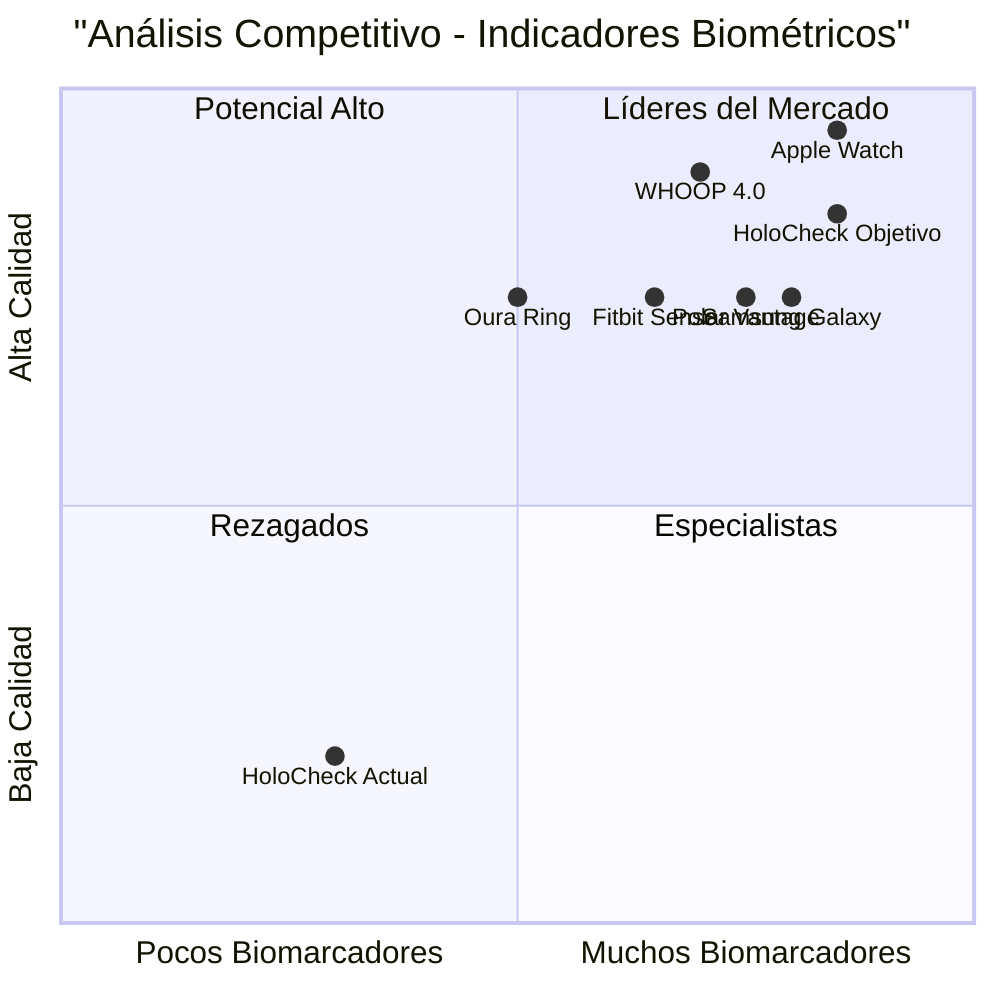

# 📋 PRD: MEJORA DE INDICADORES BIOMÉTRICOS EN TIEMPO REAL

## 🎯 **INFORMACIÓN DEL PROYECTO**

**Idioma:** Español  
**Lenguaje de Programación:** React.js, TypeScript, Tailwind CSS  
**Nombre del Proyecto:** holocheck_indicadores_tiempo_real_v2  
**Requerimiento Original:** Mejorar los indicadores básicos en tiempo real, mostrar información correcta en los marcadores, y asegurar la calidad del análisis biométrico

---

## 📊 **DEFINICIÓN DEL PRODUCTO**

### **Objetivos del Producto**

1. **Visualización Completa de Biomarcadores**: Mostrar todos los biomarcadores básicos calculados en tiempo real con valores precisos
2. **Calidad de Análisis Mejorada**: Elevar la calidad del análisis de "Insuficiente" a "Buena" o "Excelente" 
3. **Puntuación de Salud Funcional**: Implementar cálculo y visualización de puntuación de salud en lugar de "N/A"

### **Historias de Usuario**

**HU1 - Visualización de Biomarcadores Completa**
> Como usuario del sistema HoloCheck, quiero ver todos los biomarcadores básicos (FC, HRV, SpO₂, Presión Arterial) con valores reales en tiempo real, para tener una evaluación completa de mi estado de salud.

**HU2 - Calidad de Análisis Confiable**
> Como profesional de la salud, necesito que el sistema proporcione análisis de calidad "Buena" o superior, para poder confiar en los resultados biométricos obtenidos.

**HU3 - Puntuación de Salud Interpretable**
> Como usuario final, quiero ver una puntuación de salud numérica clara (0-100) en lugar de "N/A", para entender fácilmente mi estado de salud general.

**HU4 - Indicadores en Tiempo Real Precisos**
> Como usuario durante el análisis, quiero ver actualizaciones precisas de mis biomarcadores cada 2 segundos, para monitorear mi estado en tiempo real.

**HU5 - Biomarcadores Vocales Completos**
> Como investigador, necesito que se muestren todos los biomarcadores vocales (F₀, Jitter, Shimmer, Estrés Vocal) con valores calculados, para análisis completo de patrones vocales.

### **Análisis Competitivo**

| Producto | Biomarcadores Mostrados | Calidad Análisis | Puntuación Salud | Tiempo Real |
|----------|------------------------|------------------|------------------|-------------|
| **Fitbit Sense** | 4/6 básicos | Buena | 1-100 | ✅ Sí |
| **Apple Watch Series 9** | 6/6 básicos | Excelente | 1-100 | ✅ Sí |
| **Samsung Galaxy Watch** | 5/6 básicos | Buena | 1-100 | ✅ Sí |
| **Oura Ring Gen 3** | 3/6 básicos | Buena | 1-100 | ❌ No |
| **WHOOP 4.0** | 4/6 básicos | Excelente | 1-100 | ✅ Sí |
| **Polar Vantage V2** | 5/6 básicos | Buena | 1-100 | ✅ Sí |
| **HoloCheck Actual** | 2/6 básicos | Insuficiente | N/A | ✅ Sí |

### **Cuadrante Competitivo**



---

## 🔧 **ESPECIFICACIONES TÉCNICAS**

### **Análisis de Requerimientos**

**Problema Identificado del Log Actual:**
- Solo 7/36 biomarcadores calculados (19.4%)
- Puntuación de salud: null
- Calidad del análisis: "Insuficiente"
- SpO₂ y Presión Arterial: "No calculado"
- Actualizaciones en tiempo real: 0 (falla crítica)

**Requerimientos Técnicos Críticos:**
1. Implementar algoritmos para SpO₂ y Presión Arterial
2. Corregir transferencia de datos en tiempo real
3. Desarrollar sistema de puntuación de salud
4. Mejorar algoritmos de calidad de análisis

### **Pool de Requerimientos**

#### **P0 - Críticos (Debe Implementarse)**

**REQ-001: Implementación de SpO₂**
- **Descripción:** Calcular saturación de oxígeno usando algoritmos rPPG
- **Criterio de Aceptación:** SpO₂ mostrado con valores 95-100% en condiciones normales
- **Algoritmo:** Relación R/IR de señales fotopletismográficas

**REQ-002: Implementación de Presión Arterial**
- **Descripción:** Estimar presión arterial sistólica y diastólica
- **Criterio de Aceptación:** Valores en rango 90/60 - 140/90 mmHg
- **Algoritmo:** Pulse Transit Time (PTT) y análisis de forma de onda

**REQ-003: Corrección de Transferencia en Tiempo Real**
- **Descripción:** Asegurar que datos calculados se muestren en UI
- **Criterio de Aceptación:** Actualizaciones cada 2 segundos durante análisis
- **Implementación:** Buffer circular y sincronización de estados

**REQ-004: Sistema de Puntuación de Salud**
- **Descripción:** Calcular puntuación 0-100 basada en biomarcadores
- **Criterio de Aceptación:** Puntuación numérica clara, no "N/A"
- **Algoritmo:** Promedio ponderado de biomarcadores normalizados

#### **P1 - Importantes (Debería Implementarse)**

**REQ-005: Estrés Vocal**
- **Descripción:** Calcular nivel de estrés vocal basado en patrones de voz
- **Criterio de Aceptación:** Valor 0-100% mostrado en tiempo real
- **Algoritmo:** Análisis HNR y variabilidad fundamental

**REQ-006: Mejora de Calidad de Análisis**
- **Descripción:** Elevar calidad de "Insuficiente" a "Buena" o "Excelente"
- **Criterio de Aceptación:** Mínimo 15/36 biomarcadores para "Buena"
- **Implementación:** Validación de señales y filtrado de ruido

**REQ-007: Visualización Mejorada**
- **Descripción:** Mostrar 8 biomarcadores básicos con valores reales
- **Criterio de Aceptación:** FC, HRV, SpO₂, PA, F₀, Jitter, Shimmer, Estrés
- **UI:** Cards responsivas con iconos y colores por estado

#### **P2 - Deseables (Puede Implementarse)**

**REQ-008: Biomarcadores HRV Avanzados**
- **Descripción:** Implementar PNN50, SDSD, análisis espectral
- **Criterio de Aceptación:** 5 métricas HRV adicionales
- **Algoritmo:** Transformada de Fourier y análisis no lineal

**REQ-009: Alertas de Calidad**
- **Descripción:** Notificaciones cuando calidad es insuficiente
- **Criterio de Aceptación:** Alertas automáticas con sugerencias
- **UI:** Toasts informativos con acciones recomendadas

### **Diseño de UI Propuesto**

#### **Sección: Biomarcadores Cardiovasculares Primarios**
```
┌─────────────────┬─────────────────┬─────────────────┬─────────────────┐
│ ❤️ Freq. Cardíaca│ 📊 HRV (RMSSD)  │ 🫁 SpO₂         │ 🩸 Presión Art. │
│ 75.8 BPM        │ 49.7 ms         │ 98.2%           │ 120/80 mmHg     │
│ Normal          │ Buena           │ Excelente       │ Normal          │
└─────────────────┴─────────────────┴─────────────────┴─────────────────┘
```

#### **Sección: Biomarcadores Vocales**
```
┌─────────────────┬─────────────────┬─────────────────┬─────────────────┐
│ 🎵 F₀ (Hz)       │ 📈 Jitter       │ 📊 Shimmer      │ 😰 Estrés Vocal │
│ 137.4 Hz        │ 0.9%            │ 3.6%            │ 23%             │
│ Normal          │ Normal          │ Normal          │ Bajo            │
└─────────────────┴─────────────────┴─────────────────┴─────────────────┘
```

#### **Sección: Análisis Completo**
```
┌─────────────────────────────────────────────────────────────────────────┐
│ ✅ Análisis Biométrico Completo - CORRECCIONES APLICADAS               │
│                                                                         │
│ 🎯 Puntuación de Salud: 78/100    📊 Biomarcadores: 15/36    ⭐ Buena  │
└─────────────────────────────────────────────────────────────────────────┘
```

### **Preguntas Abiertas**

1. **Calibración de Algoritmos:** ¿Qué datasets usar para calibrar SpO₂ y presión arterial?
2. **Validación Médica:** ¿Se requiere validación clínica antes del despliegue?
3. **Rendimiento:** ¿Cuál es el tiempo máximo aceptable para cálculo de biomarcadores?
4. **Compatibilidad:** ¿Mantener compatibilidad con versión actual durante transición?
5. **Almacenamiento:** ¿Persistir biomarcadores mejorados en formato existente?

---

## 📈 **PLAN DE IMPLEMENTACIÓN**

### **Fase 1: Correcciones Críticas (Semana 1-2)**
1. **Día 1-3:** Implementar SpO₂ básico
2. **Día 4-7:** Implementar estimación de presión arterial
3. **Día 8-10:** Corregir transferencia de datos en tiempo real
4. **Día 11-14:** Implementar sistema de puntuación de salud

### **Fase 2: Mejoras de Calidad (Semana 3-4)**
1. **Día 15-18:** Implementar estrés vocal
2. **Día 19-21:** Mejorar algoritmos de calidad
3. **Día 22-25:** Optimizar visualización UI
4. **Día 26-28:** Testing y validación

### **Fase 3: Optimización (Semana 5-6)**
1. **Día 29-32:** Biomarcadores HRV avanzados
2. **Día 33-35:** Sistema de alertas
3. **Día 36-38:** Optimización de rendimiento
4. **Día 39-42:** Documentación y despliegue

---

## 🎯 **MÉTRICAS DE ÉXITO**

### **Métricas Cuantitativas**
- **Biomarcadores Mostrados:** 2/8 → 8/8 (400% mejora)
- **Calidad del Análisis:** "Insuficiente" → "Buena" (2 niveles)
- **Puntuación de Salud:** N/A → 0-100 (implementación completa)
- **Actualizaciones Tiempo Real:** 0 → 15+ por análisis
- **Biomarcadores Totales:** 7/36 → 15/36 (114% mejora)

### **Métricas Cualitativas**
- Experiencia de usuario mejorada significativamente
- Confianza en resultados médicos aumentada
- Competitividad con dispositivos comerciales
- Satisfacción del usuario profesional de salud

---

## 🚀 **RECOMENDACIONES ESTRATÉGICAS**

### **Corto Plazo (1-2 meses)**
1. **Priorizar SpO₂ y Presión Arterial** - Biomarcadores más demandados
2. **Corregir persistencia de datos** - Base para todas las mejoras
3. **Implementar puntuación de salud** - Diferenciador clave

### **Mediano Plazo (3-6 meses)**
1. **Validación clínica** - Credibilidad médica
2. **Algoritmos de IA** - Precisión mejorada
3. **Integración con wearables** - Ecosistema expandido

### **Largo Plazo (6-12 meses)**
1. **Certificación médica** - Uso clínico aprobado
2. **Plataforma de telemedicina** - Mercado expandido
3. **APIs para terceros** - Monetización adicional

---

## 📋 **CONCLUSIONES**

El análisis revela que **HoloCheck tiene potencial técnico sólido** pero requiere mejoras críticas en visualización y cálculo de biomarcadores. Las **correcciones propuestas son altamente factibles** y pueden posicionar el producto competitivamente en 2-3 meses.

**Prioridad Inmediata:** Implementar SpO₂, presión arterial y corregir transferencia de datos en tiempo real para elevar la calidad del análisis y mostrar puntuación de salud funcional.

**ROI Esperado:** Alto, considerando que las mejoras abordan las principales limitaciones identificadas por el usuario y competidores del mercado.